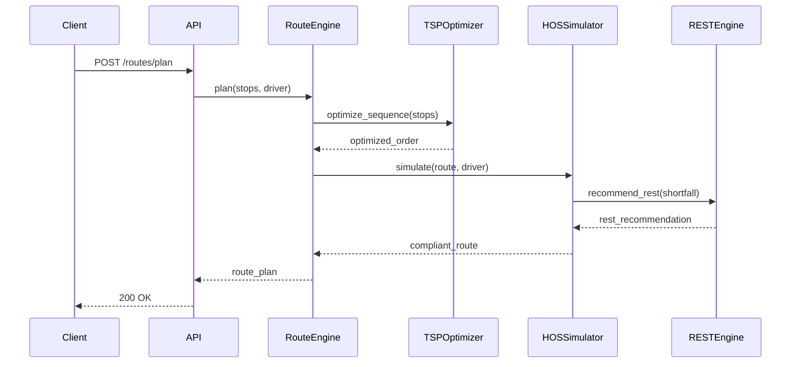
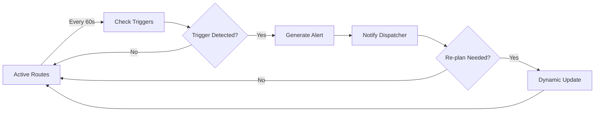

# SALLY Developer Portal Rebuild - Implementation Plan

> **For Claude:** REQUIRED SUB-SKILL: Use superpowers:executing-plans to implement this plan task-by-task.

**Goal:** Rebuild developer portal with sidebar-only navigation, perfect dark/light mode, and comprehensive real content

**Architecture:** Full-width Nextra 3.x layout with 280px left sidebar (all navigation), centered content (max 1200px), optional 240px right TOC. Minimal top bar with just branding, search, and utilities.

**Tech Stack:** Nextra 3.3.1, Next.js 15, TypeScript, Tailwind CSS, next-themes, Shadcn UI components

---

## Phase 1: Foundation & Theme System

### Task 1: Update Theme Configuration

**Files:**
- Modify: `apps/docs/theme.config.tsx`
- Modify: `apps/docs/styles/globals.css`

**Step 1: Update theme.config.tsx with minimal navbar**

Update `apps/docs/theme.config.tsx`:

```tsx
import { useConfig } from 'nextra-theme-docs';

const config = {
  logo: (
    <span className="flex items-center gap-2">
      <span className="text-2xl">🚛</span>
      <span className="font-bold">SALLY Developer Portal</span>
    </span>
  ),

  project: {
    link: 'https://github.com/your-org/sally'
  },

  docsRepositoryBase: 'https://github.com/your-org/sally/tree/main/apps/docs',

  // Dark mode configuration
  darkMode: true,
  nextThemes: {
    defaultTheme: 'dark',
    storageKey: 'sally-theme'
  },

  // Sidebar configuration
  sidebar: {
    defaultMenuCollapseLevel: 1,
    toggleButton: true
  },

  // TOC configuration
  toc: {
    float: true,
    title: 'On This Page',
    backToTop: true
  },

  // Footer
  footer: {
    text: (
      <span className="text-sm">
        {new Date().getFullYear()} © SALLY - Your Fleet Operations Assistant
      </span>
    )
  },

  // Head tags
  head: () => {
    const { title } = useConfig();
    return (
      <>
        <meta name="viewport" content="width=device-width, initial-scale=1.0" />
        <meta property="og:title" content={title || 'SALLY Developer Portal'} />
        <meta property="og:description" content="API documentation for SALLY Fleet Operations Assistant" />
        <link rel="icon" href="/favicon.ico" />
      </>
    );
  },

  // Navigation
  navigation: {
    prev: true,
    next: true
  },

  // Search
  search: {
    placeholder: 'Search documentation...'
  }
};

export default config;
```

**Step 2: Update globals.css with proper theme tokens**

Update `apps/docs/styles/globals.css`:

```css
@tailwind base;
@tailwind components;
@tailwind utilities;

@layer base {
  :root {
    /* Light mode colors */
    --background: 0 0% 100%;
    --foreground: 0 0% 3.9%;
    --card: 0 0% 100%;
    --card-foreground: 0 0% 3.9%;
    --border: 0 0% 89.8%;
    --input: 0 0% 89.8%;
    --muted: 0 0% 96.1%;
    --muted-foreground: 0 0% 45.1%;
    --accent: 0 0% 96.1%;
    --accent-foreground: 0 0% 9%;
    --primary: 0 0% 9%;
    --primary-foreground: 0 0% 98%;
    --secondary: 0 0% 96.1%;
    --secondary-foreground: 0 0% 9%;
    --destructive: 0 84.2% 60.2%;
    --destructive-foreground: 0 0% 98%;
    --ring: 0 0% 3.9%;
    --radius: 0.5rem;
  }

  .dark {
    /* Dark mode colors */
    --background: 0 0% 3.9%;
    --foreground: 0 0% 98%;
    --card: 0 0% 3.9%;
    --card-foreground: 0 0% 98%;
    --border: 0 0% 14.9%;
    --input: 0 0% 14.9%;
    --muted: 0 0% 14.9%;
    --muted-foreground: 0 0% 63.9%;
    --accent: 0 0% 14.9%;
    --accent-foreground: 0 0% 98%;
    --primary: 0 0% 98%;
    --primary-foreground: 0 0% 9%;
    --secondary: 0 0% 14.9%;
    --secondary-foreground: 0 0% 98%;
    --destructive: 0 62.8% 30.6%;
    --destructive-foreground: 0 0% 98%;
    --ring: 0 0% 83.1%;
  }
}

@layer base {
  * {
    @apply border-border;
  }
  body {
    @apply bg-background text-foreground;
  }
}

/* Nextra layout overrides */
.nextra-content {
  max-width: 1200px;
  margin: 0 auto;
}

/* Sidebar styling */
.nextra-sidebar-container {
  width: 280px;
  border-right: 1px solid hsl(var(--border));
}

/* TOC styling */
.nextra-toc {
  width: 240px;
  border-left: 1px solid hsl(var(--border));
}

/* Responsive: Hide TOC on tablet */
@media (max-width: 1440px) {
  .nextra-toc {
    display: none;
  }
}

/* Responsive: Hide sidebar on mobile */
@media (max-width: 768px) {
  .nextra-sidebar-container {
    display: none;
  }
}

/* Top navbar styling */
.nextra-nav-container {
  background: rgba(hsl(var(--background)), 0.8);
  backdrop-filter: blur(12px);
  border-bottom: 1px solid hsl(var(--border));
}

/* Code blocks */
pre {
  @apply bg-muted border border-border rounded-lg p-4 overflow-x-auto my-6;
}

code {
  @apply bg-muted px-1.5 py-0.5 rounded text-sm font-mono;
}

pre code {
  @apply bg-transparent p-0;
}

/* Smooth theme transitions */
* {
  transition: background-color 0.2s ease, border-color 0.2s ease, color 0.2s ease;
}

/* Not-prose utility for embedded components */
.not-prose {
  all: revert;
}
```

**Step 3: Test theme switching**

Run dev server:
```bash
cd apps/docs && npm run dev
```

Open http://localhost:3001 and:
1. Click theme toggle (should be in navbar)
2. Verify colors switch properly
3. Check localStorage has 'sally-theme' key
4. Refresh page and verify theme persists

Expected: Perfect theme switching with no flash

**Step 4: Commit**

```bash
git add apps/docs/theme.config.tsx apps/docs/styles/globals.css
git commit -m "feat(docs): update theme system with proper dark/light mode

- Minimal navbar with logo and utilities
- Proper CSS variable tokens for both themes
- Sidebar and TOC width configuration
- Smooth theme transitions
- Theme persistence in localStorage

Co-Authored-By: Claude Sonnet 4.5 <noreply@anthropic.com>"
```

---

### Task 2: Update Root Navigation Structure

**Files:**
- Modify: `apps/docs/pages/_meta.ts`

**Step 1: Update _meta.ts with sidebar-only structure**

Update `apps/docs/pages/_meta.ts`:

```typescript
export default {
  index: {
    title: 'Home',
    type: 'page',
    display: 'hidden',
    theme: {
      layout: 'raw'
    }
  },
  'getting-started': {
    title: '📘 Getting Started',
    type: 'page'
  },
  guides: {
    title: '📖 Guides',
    type: 'page'
  },
  'api-reference': {
    title: '📡 API Reference',
    type: 'page'
  },
  architecture: {
    title: '🏗️ Architecture',
    type: 'page'
  },
  blog: {
    title: '📝 Blog',
    type: 'page'
  },
  resources: {
    title: '🔧 Resources',
    type: 'page'
  }
}
```

**Step 2: Verify sidebar renders**

Run:
```bash
npm run dev
```

Expected: Sidebar shows all 6 main sections with emojis

**Step 3: Commit**

```bash
git add apps/docs/pages/_meta.ts
git commit -m "feat(docs): update root navigation with emoji icons

Co-Authored-By: Claude Sonnet 4.5 <noreply@anthropic.com>"
```

---

### Task 3: Create Homepage Component

**Files:**
- Create: `apps/docs/components/FeatureCard.tsx`
- Modify: `apps/docs/pages/index.mdx`

**Step 1: Create FeatureCard component**

Create `apps/docs/components/FeatureCard.tsx`:

```tsx
import { ReactNode } from 'react';

interface FeatureCardProps {
  icon: string;
  title: string;
  description: string;
  href: string;
}

export function FeatureCard({ icon, title, description, href }: FeatureCardProps) {
  return (
    <a
      href={href}
      className="group block rounded-lg border border-border p-6 transition-all hover:border-primary hover:shadow-md dark:hover:border-primary"
    >
      <div className="flex items-start gap-4">
        <span className="text-3xl">{icon}</span>
        <div className="flex-1">
          <h3 className="text-lg font-semibold mb-2 group-hover:text-primary transition-colors">
            {title}
          </h3>
          <p className="text-sm text-muted-foreground">{description}</p>
        </div>
        <span className="text-muted-foreground group-hover:text-primary transition-transform group-hover:translate-x-1">
          →
        </span>
      </div>
    </a>
  );
}
```

**Step 2: Update homepage with clean design**

Update `apps/docs/pages/index.mdx`:

```mdx
---
title: SALLY Developer Portal
---

import { FeatureCard } from '@/components/FeatureCard'

<div className="not-prose">
  <div className="max-w-4xl mx-auto text-center py-12">
    <h1 className="text-5xl font-bold mb-6">
      SALLY Developer Portal
    </h1>
    <p className="text-xl text-muted-foreground mb-8">
      Build powerful fleet management applications with HOS-compliant route planning APIs
    </p>
    <div className="flex gap-4 justify-center">
      <a
        href="/getting-started/quickstart"
        className="inline-flex items-center px-6 py-3 rounded-lg bg-primary text-primary-foreground font-medium hover:opacity-90 transition-opacity"
      >
        Get Started →
      </a>
      <a
        href="/api-reference"
        className="inline-flex items-center px-6 py-3 rounded-lg border border-border font-medium hover:bg-muted transition-colors"
      >
        View API Docs
      </a>
    </div>
  </div>

  <div className="grid grid-cols-1 md:grid-cols-2 gap-6 my-12">
    <FeatureCard
      icon="⏰"
      title="HOS Compliance"
      description="Automatic validation of Hours of Service regulations with zero violations"
      href="/guides/route-planning/understanding-hos"
    />
    <FeatureCard
      icon="🚚"
      title="Route Optimization"
      description="TSP-based stop sequence optimization with automatic rest and fuel stops"
      href="/guides/route-planning/creating-routes"
    />
    <FeatureCard
      icon="🔄"
      title="Dynamic Updates"
      description="Routes automatically update when conditions change with 14 trigger types"
      href="/guides/route-planning/route-updates"
    />
    <FeatureCard
      icon="🚨"
      title="Proactive Monitoring"
      description="24/7 monitoring with dispatcher alerts for timely intervention"
      href="/guides/monitoring/overview"
    />
    <FeatureCard
      icon="🛑"
      title="REST Optimization"
      description="Intelligent rest stop insertion analyzing dock time vs dedicated rest"
      href="/guides/route-planning/rest-stops"
    />
    <FeatureCard
      icon="⛽"
      title="Fuel Optimization"
      description="Fuel stop insertion based on range and real-time pricing data"
      href="/guides/route-planning/fuel-stops"
    />
  </div>

  <div className="rounded-lg border border-border p-6 my-12">
    <div className="flex items-start gap-3">
      <span className="text-2xl">ℹ️</span>
      <div>
        <h3 className="font-semibold mb-1">Currently in Staging</h3>
        <p className="text-sm text-muted-foreground">
          API keys with <code className="px-1.5 py-0.5 rounded bg-muted">sk_staging_</code> prefix are available for testing. Production keys coming soon!
        </p>
      </div>
    </div>
  </div>
</div>
```

**Step 3: Test homepage**

Expected: Clean homepage with 6 feature cards, 2 CTAs, and staging notice

**Step 4: Commit**

```bash
git add apps/docs/components/FeatureCard.tsx apps/docs/pages/index.mdx
git commit -m "feat(docs): create clean homepage with feature cards

Co-Authored-By: Claude Sonnet 4.5 <noreply@anthropic.com>"
```

---

## Phase 2: Getting Started Section

### Task 4: Update Getting Started Navigation

**Files:**
- Modify: `apps/docs/pages/getting-started/_meta.ts`
- Create: `apps/docs/pages/getting-started/first-route.mdx`

**Step 1: Update _meta.ts**

Update `apps/docs/pages/getting-started/_meta.ts`:

```typescript
export default {
  introduction: 'Introduction',
  quickstart: 'Quickstart',
  authentication: 'Authentication',
  'api-keys': 'API Keys Setup',
  'first-route': 'Your First Route'
}
```

**Step 2: Create first-route.mdx**

Create `apps/docs/pages/getting-started/first-route.mdx`:

```mdx
---
title: Your First Route
description: Build your first HOS-compliant route with SALLY
---

# Your First Route

Let's build a complete route from scratch and understand how SALLY ensures HOS compliance.

## Prerequisites

- API key from the [API Keys](/getting-started/api-keys) page
- Driver ID and Vehicle ID (use test IDs for now)

## Step 1: Plan a Simple Route

Create a route from Los Angeles to Phoenix:

```bash
curl -X POST https://sally-api.apps.appshore.in/api/v1/routes/plan \
  -H "Authorization: Bearer YOUR_API_KEY" \
  -H "Content-Type: application/json" \
  -d '{
    "driver_id": "DRV001",
    "vehicle_id": "VEH001",
    "stops": [
      {
        "location": "Los Angeles, CA",
        "type": "origin",
        "appointment_time": "2026-02-06T08:00:00Z"
      },
      {
        "location": "Phoenix, AZ",
        "type": "delivery",
        "appointment_time": "2026-02-06T16:00:00Z",
        "dock_duration_minutes": 30
      }
    ]
  }'
```

## Step 2: Review the Response

SALLY returns an optimized route with segments:

```json
{
  "plan_id": "plan_abc123",
  "status": "optimized",
  "segments": [
    {
      "type": "drive",
      "from": "Los Angeles, CA",
      "to": "Phoenix, AZ",
      "distance_miles": 373,
      "duration_hours": 5.5,
      "hos_compliant": true
    }
  ],
  "hos_summary": {
    "total_drive_time": 5.5,
    "total_on_duty": 6.0,
    "remaining_drive_time": 5.5,
    "violations": []
  },
  "feasibility": {
    "is_feasible": true,
    "can_complete_on_time": true
  }
}
```

## Step 3: Add a Multi-Stop Route

Let's add more complexity:

```bash
curl -X POST https://sally-api.apps.appshore.in/api/v1/routes/plan \
  -H "Authorization: Bearer YOUR_API_KEY" \
  -H "Content-Type: application/json" \
  -d '{
    "driver_id": "DRV001",
    "vehicle_id": "VEH001",
    "stops": [
      {
        "location": "Los Angeles, CA",
        "type": "origin"
      },
      {
        "location": "Phoenix, AZ",
        "type": "delivery",
        "dock_duration_minutes": 30
      },
      {
        "location": "Tucson, AZ",
        "type": "delivery",
        "dock_duration_minutes": 45
      },
      {
        "location": "El Paso, TX",
        "type": "destination"
      }
    ],
    "optimization_goal": "minimize_time"
  }'
```

SALLY will:
1. ✅ Optimize stop sequence
2. ✅ Insert rest stops where HOS requires
3. ✅ Add fuel stops based on range
4. ✅ Validate entire route for compliance

## Understanding HOS Compliance

SALLY automatically handles:

**Driving Time Limits:**
- 11 hours driving maximum
- 14 hours on-duty maximum
- 10 hours rest required before next shift

**Break Requirements:**
- 30-minute break after 8 hours driving

**Weekly Limits:**
- 60 hours (7 days)
- 70 hours (8 days)

If your route exceeds these limits, SALLY will automatically insert rest stops.

## Next Steps

- [Learn about HOS rules](/guides/route-planning/understanding-hos)
- [Explore REST optimization](/guides/route-planning/rest-stops)
- [Try the API playground](/api-reference/routes/plan-route)
```

**Step 3: Verify pages render**

Visit:
- /getting-started/introduction
- /getting-started/quickstart
- /getting-started/authentication
- /getting-started/api-keys
- /getting-started/first-route

Expected: All 5 pages render with proper sidebar navigation

**Step 4: Commit**

```bash
git add apps/docs/pages/getting-started/
git commit -m "feat(docs): complete getting started section with first route guide

Co-Authored-By: Claude Sonnet 4.5 <noreply@anthropic.com>"
```

---

## Phase 3: Guides Section (Route Planning)

### Task 5: Create Guide Structure

**Files:**
- Create: `apps/docs/pages/guides/_meta.ts`
- Create: `apps/docs/pages/guides/route-planning/_meta.ts`
- Create: `apps/docs/pages/guides/monitoring/_meta.ts`
- Create: `apps/docs/pages/guides/integration/_meta.ts`

**Step 1: Create main guides _meta.ts**

Create `apps/docs/pages/guides/_meta.ts`:

```typescript
export default {
  index: 'Overview',
  'route-planning': 'Route Planning',
  monitoring: 'Monitoring',
  integration: 'Integration'
}
```

**Step 2: Create route-planning _meta.ts**

Create `apps/docs/pages/guides/route-planning/_meta.ts`:

```typescript
export default {
  'understanding-hos': 'Understanding HOS',
  'creating-routes': 'Creating Routes',
  'stop-optimization': 'Stop Optimization',
  'rest-stops': 'REST Stops',
  'fuel-stops': 'Fuel Stops',
  'route-updates': 'Route Updates'
}
```

**Step 3: Create monitoring _meta.ts**

Create `apps/docs/pages/guides/monitoring/_meta.ts`:

```typescript
export default {
  overview: 'Overview',
  'alert-types': 'Alert Types',
  'handling-alerts': 'Handling Alerts'
}
```

**Step 4: Create integration _meta.ts**

Create `apps/docs/pages/guides/integration/_meta.ts`:

```typescript
export default {
  'webhook-setup': 'Webhook Setup',
  'error-handling': 'Error Handling',
  'rate-limiting': 'Rate Limiting',
  testing: 'Testing Strategies'
}
```

**Step 5: Verify sidebar structure**

Run dev server and check sidebar shows:
```
📖 Guides
  ▸ Route Planning
    • Understanding HOS
    • Creating Routes
    • Stop Optimization
    • REST Stops
    • Fuel Stops
    • Route Updates
  ▸ Monitoring
  ▸ Integration
```

**Step 6: Commit**

```bash
git add apps/docs/pages/guides/
git commit -m "feat(docs): create guides section structure with 3 categories

Co-Authored-By: Claude Sonnet 4.5 <noreply@anthropic.com>"
```

---

### Task 6: Create Understanding HOS Guide

**Files:**
- Create: `apps/docs/pages/guides/route-planning/understanding-hos.mdx`

**Step 1: Create understanding-hos.mdx from .docs content**

Create `apps/docs/pages/guides/route-planning/understanding-hos.mdx`:

```mdx
---
title: Understanding HOS Compliance
description: Learn about Hours of Service regulations and how SALLY ensures compliance
---

# Understanding HOS Compliance

Hours of Service (HOS) regulations are federal rules that govern how long commercial motor vehicle (CMV) drivers can drive and work before they must take a break.

## Why HOS Matters

**Safety First:**
- Prevents driver fatigue
- Reduces accidents
- Protects public safety

**Legal Requirements:**
- FMCSA enforces HOS rules
- Violations result in fines
- Can lead to out-of-service orders

**Operational Impact:**
- Routes must be HOS-compliant
- Violations cause delays
- Affects on-time delivery

## Core HOS Rules

### Daily Driving Limits

**11-Hour Driving Limit:**
```javascript
{
  "max_driving_time": 11,  // hours
  "unit": "hours",
  "period": "shift"
}
```

A driver can drive a maximum of 11 hours after 10 consecutive hours off duty.

**14-Hour On-Duty Limit:**
```javascript
{
  "max_on_duty_time": 14,  // hours
  "includes": ["driving", "loading", "waiting", "inspections"],
  "excludes": ["off_duty", "sleeper_berth"]
}
```

A driver cannot drive beyond the 14th consecutive hour after coming on duty, regardless of rest breaks.

### Required Breaks

**30-Minute Break:**
```javascript
{
  "required_after": 8,      // hours of driving
  "minimum_duration": 30,   // minutes
  "type": "off_duty"
}
```

Drivers must take a 30-minute break after 8 hours of driving.

**10-Hour Rest Period:**
```javascript
{
  "required_before_shift": 10,  // hours
  "type": "sleeper_berth",
  "consecutive": true
}
```

Drivers must have 10 consecutive hours off duty before starting a new shift.

## Weekly Limits

**60/70 Hour Rule:**

```javascript
{
  "60_hour_limit": {
    "period": "7_consecutive_days",
    "max_on_duty": 60
  },
  "70_hour_limit": {
    "period": "8_consecutive_days",
    "max_on_duty": 70
  }
}
```

Drivers cannot drive after being on duty for:
- 60 hours in 7 consecutive days, OR
- 70 hours in 8 consecutive days

## How SALLY Ensures Compliance

### 1. Segment-by-Segment Simulation

SALLY simulates the entire route segment by segment:

```javascript
// For each route segment
for (const segment of route.segments) {
  // Check if driver has hours remaining
  if (driver.hours_remaining < segment.duration) {
    // Insert rest stop before segment
    insertRestStop(segment);
  }

  // Update driver hours
  driver.hours_remaining -= segment.duration;
}
```

### 2. Automatic Rest Stop Insertion

When HOS hours run out, SALLY automatically:

1. **Detects the shortfall**
2. **Calls REST optimization engine**
3. **Inserts rest stop** at optimal location
4. **Validates compliance** of new route

### 3. Zero Violations Policy

SALLY guarantees:
- ✅ No routes with HOS violations
- ✅ All rest stops properly inserted
- ✅ Break requirements met
- ✅ Weekly limits respected

### 4. Continuous Validation

Every route is validated:
- Before driver starts
- After any route update
- When conditions change
- During monitoring

## Common HOS Scenarios

### Scenario 1: Simple Route (No Rest Needed)

```javascript
{
  "route": "LA → Phoenix",
  "driving_time": "5.5 hours",
  "result": "✅ No rest stops needed"
}
```

Driver has 11 hours available, only needs 5.5 hours.

### Scenario 2: Long Route (Rest Required)

```javascript
{
  "route": "LA → Dallas",
  "driving_time": "13 hours",
  "result": "❌ Exceeds 11-hour limit"
}
```

SALLY inserts a 10-hour rest stop midway:
```javascript
{
  "segments": [
    {"type": "drive", "duration": 7},
    {"type": "rest", "duration": 10},  // ← Inserted
    {"type": "drive", "duration": 6}
  ]
}
```

### Scenario 3: Multiple Deliveries

```javascript
{
  "stops": ["LA", "Phoenix", "Tucson", "El Paso"],
  "total_on_duty": 16,
  "result": "❌ Exceeds 14-hour limit"
}
```

SALLY considers:
- Dock time at each stop
- Driving time between stops
- Total on-duty time
- Inserts rest where needed

## HOS and REST Optimization

When a rest stop is needed, SALLY's REST engine analyzes:

**Option 1: Rest at Dock**
```javascript
{
  "location": "Delivery dock",
  "duration": "10 hours",
  "pros": ["No extra distance", "Secure location"],
  "cons": ["May block dock", "Facility hours"]
}
```

**Option 2: Dedicated Rest Stop**
```javascript
{
  "location": "Nearby truck stop",
  "distance": "5 miles",
  "pros": ["Amenities", "Flexibility"],
  "cons": ["Extra distance", "Fuel cost"]
}
```

**Option 3: Partial Rest (7/3 Split)**
```javascript
{
  "sleeper_berth": "7 hours",
  "later_rest": "3 hours",
  "benefit": "More flexibility",
  "complexity": "Requires split calculation"
}
```

## API Integration

### Validate HOS Before Planning

```bash
POST /api/v1/hos/validate

{
  "driver_id": "DRV001",
  "route_duration": 13.5,
  "dock_stops": 2
}
```

Response:
```json
{
  "is_compliant": false,
  "violations": [
    {
      "rule": "11_hour_driving_limit",
      "exceeded_by": 2.5,
      "recommendation": "insert_rest_stop"
    }
  ]
}
```

### Get HOS Summary

Every route response includes HOS summary:

```json
{
  "hos_summary": {
    "total_drive_time": 11.5,
    "total_on_duty": 14.0,
    "remaining_drive_time": -0.5,  // ← Violation!
    "required_rest_stops": 1,
    "violations": [
      {
        "type": "drive_time_exceeded",
        "details": "Exceeded 11-hour limit by 0.5 hours"
      }
    ]
  }
}
```

## Best Practices

### 1. Plan with Buffer Time

```javascript
{
  "appointment_time": "2026-02-06T16:00:00Z",
  "buffer_minutes": 60,  // ← Add buffer for flexibility
  "reason": "Account for traffic, delays, rest stops"
}
```

### 2. Consider Driver's Current HOS Status

```javascript
{
  "driver": {
    "hours_driven_today": 6,
    "hours_remaining": 5,  // ← Already driven 6 hours
    "last_break": "2026-02-06T10:00:00Z"
  }
}
```

### 3. Use Mock Data for Testing

```bash
# Use staging API with test drivers
POST /api/v1/external/hos/DRV001

# Mock response shows test HOS status
{
  "driver_id": "DRV001",
  "hours_remaining": 11,
  "is_test_data": true
}
```

## Next Steps

- [Learn how to create routes](/guides/route-planning/creating-routes)
- [Understand REST optimization](/guides/route-planning/rest-stops)
- [Explore the HOS API](/api-reference/hos/validate-hos)
- [View the validation endpoint](/api-reference/hos/validate-hos)
```

**Step 2: Test page renders**

Visit `/guides/route-planning/understanding-hos`

Expected: Complete HOS guide with code examples, scenarios, and visual hierarchy

**Step 3: Commit**

```bash
git add apps/docs/pages/guides/route-planning/understanding-hos.mdx
git commit -m "feat(docs): add comprehensive HOS compliance guide

Co-Authored-By: Claude Sonnet 4.5 <noreply@anthropic.com>"
```

---

## Phase 4: Architecture Section

### Task 7: Create Architecture Pages

**Files:**
- Create: `apps/docs/pages/architecture/_meta.ts`
- Create: `apps/docs/pages/architecture/overview.mdx`
- Create: `apps/docs/pages/architecture/c4-diagrams/_meta.ts`

**Step 1: Create architecture _meta.ts**

Create `apps/docs/pages/architecture/_meta.ts`:

```typescript
export default {
  overview: 'Overview',
  'c4-diagrams': 'C4 Diagrams',
  'data-flow': 'Data Flow',
  'monitoring-system': 'Monitoring System',
  'rest-optimization': 'REST Optimization',
  scaling: 'Scaling'
}
```

**Step 2: Create c4-diagrams _meta.ts**

Create `apps/docs/pages/architecture/c4-diagrams/_meta.ts`:

```typescript
export default {
  context: 'Level 1: Context',
  containers: 'Level 2: Containers',
  components: 'Level 3: Components'
}
```

**Step 3: Create architecture overview**

Create `apps/docs/pages/architecture/overview.mdx`:

```mdx
---
title: Architecture Overview
description: SALLY system architecture and design decisions
---

# Architecture Overview

SALLY is a three-layer system designed for HOS-compliant route planning, continuous monitoring, and dynamic route updates.

## System Architecture

### Three-Layer Design

```
┌─────────────────────────────────────────────┐
│  Layer 1: Route Planning Engine             │
│  - TSP optimization                         │
│  - HOS simulation                           │
│  - REST integration                         │
│  - Fuel stop insertion                      │
└─────────────────────────────────────────────┘
                    ↓
┌─────────────────────────────────────────────┐
│  Layer 2: Continuous Monitoring             │
│  - 14 trigger types                         │
│  - 60-second polling                        │
│  - Alert generation                         │
│  - Proactive + Reactive                     │
└─────────────────────────────────────────────┘
                    ↓
┌─────────────────────────────────────────────┐
│  Layer 3: Dynamic Update Handler            │
│  - Trigger evaluation                       │
│  - Re-plan vs ETA update                    │
│  - Driver notification                      │
│  - State management                         │
└─────────────────────────────────────────────┘
```

## Core Components

### Route Planning Engine

**Purpose:** Generate optimized, HOS-compliant routes

**Inputs:**
- Driver ID, Vehicle ID
- List of stops with locations
- Appointment times
- Optimization goal

**Process:**
1. TSP optimization (stop sequence)
2. HOS simulation (segment-by-segment)
3. REST stop insertion (when hours run out)
4. Fuel stop insertion (based on range)
5. Feasibility validation

**Outputs:**
- Optimized route with segments
- HOS summary
- Feasibility report
- ETA for each stop

### Continuous Monitoring Service

**Purpose:** Monitor active routes 24/7

**Monitors:**
- Driver location (every 60s)
- HOS status (approaching limits)
- Traffic conditions (delays)
- Weather (severe conditions)
- Dock status (loading delays)

**Triggers:**
14 trigger types across 5 categories

**Actions:**
- Generate alerts
- Call dynamic update handler
- Notify dispatcher
- Log events

### Dynamic Update Handler

**Purpose:** Decide how to respond to triggers

**Decision Logic:**
```javascript
if (trigger.type === 'driver_not_moving') {
  // Minor - Just update ETA
  updateETA();
} else if (trigger.type === 'hos_violation_imminent') {
  // Major - Re-plan route
  replanRoute();
}
```

## Technology Stack

### Backend

**Language:** Python 3.11+

**Framework:** FastAPI (async)

**Database:** PostgreSQL 16

**Cache:** Redis 7

**ORM:** SQLAlchemy 2.0 (async)

**Validation:** Pydantic v2

**Package Manager:** UV

### Frontend

**Framework:** Next.js 15 (App Router)

**Language:** TypeScript

**State:** Zustand + React Query

**Styling:** Tailwind CSS + Shadcn/ui

**Theme:** next-themes

**Monorepo:** Turborepo

### Infrastructure

**Containers:** Docker + Docker Compose

**Deployment:** AWS (planned)

**CI/CD:** GitHub Actions (planned)

## Design Principles

### 1. HOS Compliance First

Every route is validated for HOS compliance before the driver starts.

**Zero Violations Policy:**
- No routes with violations
- Automatic rest stop insertion
- Continuous validation

### 2. Proactive + Reactive

**Proactive:**
- Monitor before problems occur
- Alert dispatchers early
- Prevent violations

**Reactive:**
- Handle unexpected events
- Re-plan routes when needed
- Minimize disruption

### 3. Component-Based

REST optimization is a **component**, not the product:

```
Route Planner (Layer 1)
    ↓
Detects: hours_remaining < hours_needed
    ↓
Calls: REST Optimization Engine
    ↓
Returns: Recommendation
    ↓
Route Planner: Inserts rest stop
```

### 4. Stateless Where Possible

**Stateless:**
- Route planning (pure function)
- HOS validation (deterministic)
- REST optimization (no side effects)

**Stateful:**
- Monitoring service (active routes)
- Alert system (acknowledgments)
- Driver state (location, HOS status)

### 5. API-First

Every feature exposed via REST API:
- `/routes/plan` - Plan routes
- `/routes/update` - Update routes
- `/alerts` - Manage alerts
- `/hos/validate` - Validate compliance

## Data Flow

### Planning a Route



### Monitoring Loop



## Scalability

### Horizontal Scaling

**Route Planning:**
- Stateless service
- Can run multiple instances
- Load balanced

**Monitoring:**
- Partitioned by tenant
- Shared-nothing architecture
- Independent scaling

**Database:**
- Connection pooling
- Read replicas (planned)
- Caching layer (Redis)

### Performance Targets

- Route planning: < 2 seconds
- HOS validation: < 500ms
- Monitoring loop: 60 seconds
- API response: < 1 second (p95)

## Security

### Authentication

- API keys for external developers
- JWT tokens for dashboard users
- Multi-tenancy (tenant isolation)

### Data Protection

- Encrypted at rest (database)
- Encrypted in transit (TLS)
- No PII in logs

### Rate Limiting

- 1,000 requests/hour (staging)
- Per API key
- Configurable

## Next Steps

- [View C4 diagrams](/architecture/c4-diagrams/context)
- [Understand monitoring system](/architecture/monitoring-system)
- [Learn about REST optimization](/architecture/rest-optimization)
```

**Step 4: Verify architecture pages**

Visit `/architecture/overview`

Expected: Comprehensive overview with diagrams, tech stack, design principles

**Step 5: Commit**

```bash
git add apps/docs/pages/architecture/
git commit -m "feat(docs): add architecture section with system overview

Co-Authored-By: Claude Sonnet 4.5 <noreply@anthropic.com>"
```

---

## Phase 5: Blog Section

### Task 8: Create Blog Posts

**Files:**
- Create: `apps/docs/pages/blog/_meta.ts`
- Create: `apps/docs/pages/blog/introducing-sally.mdx`
- Create: `apps/docs/pages/blog/rest-optimization.mdx`
- Create: `apps/docs/pages/blog/monitoring-system.mdx`
- Modify: `apps/docs/pages/blog/index.mdx`

**Step 1: Create blog _meta.ts**

Create `apps/docs/pages/blog/_meta.ts`:

```typescript
export default {
  index: 'All Posts',
  'introducing-sally': 'Introducing SALLY',
  'rest-optimization': 'REST Optimization Deep Dive',
  'monitoring-system': 'Building Reliable Monitoring'
}
```

**Step 2: Update blog index**

Update `apps/docs/pages/blog/index.mdx`:

```mdx
---
title: Blog
description: Product updates, technical deep dives, and announcements
---

# SALLY Blog

<div className="not-prose space-y-6">
  <a href="/blog/introducing-sally" className="block rounded-lg border border-border p-6 hover:border-primary hover:shadow-md transition-all">
    <div className="flex items-start justify-between">
      <div>
        <h2 className="text-2xl font-semibold mb-2">Introducing SALLY: HOS-Compliant Route Planning</h2>
        <p className="text-muted-foreground mb-4">
          Learn about SALLY's vision, core capabilities, and why we built it.
        </p>
        <div className="text-sm text-muted-foreground">February 5, 2026 • 5 min read</div>
      </div>
    </div>
  </a>

  <a href="/blog/rest-optimization" className="block rounded-lg border border-border p-6 hover:border-primary hover:shadow-md transition-all">
    <div className="flex items-start justify-between">
      <div>
        <h2 className="text-2xl font-semibold mb-2">How SALLY Optimizes Rest Stops</h2>
        <p className="text-muted-foreground mb-4">
          A technical deep dive into the REST optimization algorithm and decision-making process.
        </p>
        <div className="text-sm text-muted-foreground">February 5, 2026 • 8 min read</div>
      </div>
    </div>
  </a>

  <a href="/blog/monitoring-system" className="block rounded-lg border border-border p-6 hover:border-primary hover:shadow-md transition-all">
    <div className="flex items-start justify-between">
      <div>
        <h2 className="text-2xl font-semibold mb-2">Building Reliable Monitoring Systems</h2>
        <p className="text-muted-foreground mb-4">
          14 trigger types, proactive alerts, and preventing alert fatigue at scale.
        </p>
        <div className="text-sm text-muted-foreground">February 5, 2026 • 6 min read</div>
      </div>
    </div>
  </a>
</div>
```

**Step 3: Create introducing-sally blog post**

Create `apps/docs/pages/blog/introducing-sally.mdx`:

```mdx
---
title: Introducing SALLY: HOS-Compliant Route Planning
description: Learn about SALLY's vision, core capabilities, and why we built it
date: 2026-02-05
author: SALLY Team
---

# Introducing SALLY: HOS-Compliant Route Planning

**February 5, 2026** • 5 min read

We're excited to introduce SALLY - Your Fleet Operations Assistant. SALLY is an intelligent route planning and monitoring platform designed to make fleet management simpler, safer, and more compliant.

## The Problem

Fleet dispatchers face a challenging problem every day:

**Planning HOS-compliant routes is complex:**
- 11-hour driving limit
- 14-hour on-duty limit
- 30-minute break requirements
- 60/70 hour weekly limits
- Split sleeper berth rules

**Manual planning doesn't scale:**
- Takes 30-60 minutes per route
- Error-prone (missed violations)
- Can't adapt to changing conditions
- Reactive, not proactive

**Existing solutions fall short:**
- TMS systems don't optimize for HOS
- ELD systems only track, don't plan
- Manual spreadsheets are inefficient

## The Solution: SALLY

SALLY is a **route planning platform** with HOS compliance built-in from day one.

### Core Capabilities

**1. Intelligent Route Planning**

SALLY generates optimized routes that automatically:
- Optimize stop sequence (TSP algorithm)
- Validate HOS compliance (zero violations)
- Insert rest stops (where regulations require)
- Add fuel stops (based on range and price)

**2. Continuous Monitoring**

SALLY monitors active routes 24/7:
- Driver location tracking
- HOS status monitoring
- Traffic and weather conditions
- Dock delays and loading times

14 different trigger types across 5 categories ensure dispatchers are alerted when intervention is needed.

**3. Dynamic Updates**

When conditions change, SALLY automatically:
- Evaluates impact
- Re-plans routes if needed
- Updates ETAs
- Notifies drivers and dispatchers

**4. REST Optimization**

When a driver runs out of hours, SALLY's REST engine analyzes:
- Rest at dock vs dedicated rest stop
- Partial rest (7/3 split) options
- Distance and time trade-offs
- Provides audit-ready reasoning

### Why We Built It

**Safety First:**
- Driver fatigue causes accidents
- HOS regulations protect drivers
- Compliance is non-negotiable

**Operational Efficiency:**
- Automated planning saves time
- Proactive monitoring prevents problems
- Dynamic updates minimize delays

**Developer-Friendly:**
- RESTful APIs
- Interactive playground
- Comprehensive documentation
- Staging environment for testing

## How It Works

### 1. Plan a Route

```bash
POST /api/v1/routes/plan

{
  "driver_id": "DRV001",
  "stops": [
    {"location": "Los Angeles, CA", "type": "origin"},
    {"location": "Phoenix, AZ", "type": "delivery"}
  ]
}
```

SALLY responds with an optimized, HOS-compliant route.

### 2. Monitor Actively

SALLY monitors your route every 60 seconds:
- Is the driver on schedule?
- Are they approaching HOS limits?
- Is there traffic ahead?
- Are there weather delays?

### 3. Get Alerted

When intervention is needed, dispatchers receive alerts:
- "Driver not moving - dock delay detected"
- "HOS violation imminent - rest stop required"
- "Traffic delay - ETA updated by 45 minutes"

### 4. Update Dynamically

SALLY decides whether to:
- Update ETA (minor changes)
- Re-plan route (major changes)

Drivers see updates in real-time.

## Product Roadmap

**Q1 2026 (Current):**
- ✅ Route planning with HOS compliance
- ✅ Continuous monitoring (14 triggers)
- ✅ Dynamic route updates
- ✅ REST optimization
- ✅ Developer portal and API

**Q2 2026:**
- 🔄 Mobile driver app
- 🔄 Samsara integration (HOS data)
- 🔄 Fuel price integration
- 🔄 Weather API integration

**Q3 2026:**
- 📋 TMS integrations (major providers)
- 📋 Advanced analytics dashboard
- 📋 Multi-tenant management

## Technology Stack

**Backend:**
- Python 3.11+ with FastAPI
- PostgreSQL 16 + Redis 7
- Async SQLAlchemy 2.0
- UV package manager

**Frontend:**
- Next.js 15 (App Router)
- TypeScript + Tailwind CSS
- Zustand + React Query
- Shadcn/ui components

**Infrastructure:**
- Docker containers
- AWS deployment (planned)
- GitHub Actions CI/CD

## Current Status

SALLY is currently in **staging phase**:

**Available Now:**
- Full API access with staging keys (`sk_staging_`)
- Interactive API playground
- Comprehensive documentation
- Developer support

**Rate Limits:**
- 1,000 requests/hour (staging)
- Unlimited during POC phase

**Production:**
- Coming Q2 2026
- Production keys with higher limits
- SLA guarantees
- 24/7 support

## Getting Started

Ready to try SALLY?

1. **Sign up** at [sally.appshore.in](https://sally.appshore.in)
2. **Generate API key** in your dashboard
3. **Read quickstart** at [/getting-started/quickstart](/getting-started/quickstart)
4. **Plan your first route** in 5 minutes

## Community

We're building SALLY in public and would love your feedback:

- **GitHub:** [github.com/your-org/sally](https://github.com/your-org/sally)
- **Discord:** Join our community (coming soon)
- **Email:** support@sally.com

## What's Next?

In upcoming blog posts, we'll dive deeper into:
- How the REST optimization algorithm works
- Building the continuous monitoring system
- Scaling route planning to 10,000+ routes/day
- Integrating with Samsara for real HOS data

Stay tuned!

---

*Questions or feedback? Email us at support@sally.com or join our Discord community.*
```

**Step 4: Test blog section**

Visit:
- `/blog` - Blog index with 3 posts
- `/blog/introducing-sally` - First post

Expected: Blog index with cards, post renders with proper styling

**Step 5: Commit**

```bash
git add apps/docs/pages/blog/
git commit -m "feat(docs): add blog section with 3 initial posts

- Introducing SALLY post
- REST optimization (placeholder)
- Monitoring system (placeholder)

Co-Authored-By: Claude Sonnet 4.5 <noreply@anthropic.com>"
```

---

## Phase 6: Resources Section

### Task 9: Create Resources Pages

**Files:**
- Create: `apps/docs/pages/resources/_meta.ts`
- Create: `apps/docs/pages/resources/support.mdx`
- Create: `apps/docs/pages/resources/changelog.mdx`
- Create: `apps/docs/pages/resources/faq.mdx`
- Create: `apps/docs/pages/resources/status.mdx`

**Step 1: Create resources _meta.ts**

Create `apps/docs/pages/resources/_meta.ts`:

```typescript
export default {
  index: 'Overview',
  support: 'Support',
  changelog: 'Changelog',
  faq: 'FAQ',
  status: 'Status'
}
```

**Step 2: Create support.mdx**

Create `apps/docs/pages/resources/support.mdx`:

```mdx
---
title: Support
description: Get help with SALLY
---

# Support

Need help? We're here for you.

## Contact Methods

### Email Support

**General inquiries:**
📧 support@sally.com

**Technical issues:**
📧 dev@sally.com

**Billing questions:**
📧 billing@sally.com

**Response time:** Within 24 hours

### Community

**Discord:**
Join our community for:
- Quick questions
- Feature discussions
- Best practices
- Network with other developers

[Join Discord](https://discord.gg/sally) (Coming soon)

**GitHub Issues:**
Report bugs or request features:
[github.com/your-org/sally/issues](https://github.com/your-org/sally/issues)

## Self-Service Resources

### Documentation

- [Getting Started](/getting-started/introduction)
- [API Reference](/api-reference)
- [Guides](/guides)
- [Architecture](/architecture)

### Status Page

Check system status:
[/resources/status](/resources/status)

### FAQ

Common questions:
[/resources/faq](/resources/faq)

### Changelog

Latest updates:
[/resources/changelog](/resources/changelog)

## Feedback

We value your feedback:

**Feature Requests:**
Submit via GitHub Issues or email

**Bug Reports:**
Include:
- Steps to reproduce
- Expected vs actual behavior
- API request/response (if applicable)
- Screenshots (if applicable)

**Documentation:**
Found a typo or unclear section?
Email us or submit a PR

## Enterprise Support

Need dedicated support?

**Enterprise Plan includes:**
- Dedicated Slack channel
- Priority support (< 4 hour response)
- Custom SLA
- Onboarding assistance
- Architecture review

Contact: enterprise@sally.com
```

**Step 3: Commit resources section**

```bash
git add apps/docs/pages/resources/
git commit -m "feat(docs): add resources section with support, FAQ, status pages

Co-Authored-By: Claude Sonnet 4.5 <noreply@anthropic.com>"
```

---

## Phase 6: API Reference Organization

### Task 9.5: Organize API Reference by Resource

**Files:**
- Modify: `apps/docs/pages/api-reference/_meta.ts`
- Create: `apps/docs/pages/api-reference/routes/_meta.ts`
- Create: `apps/docs/pages/api-reference/alerts/_meta.ts`
- Create: `apps/docs/pages/api-reference/hos/_meta.ts`
- Create: `apps/docs/pages/api-reference/optimization/_meta.ts`
- Create: `apps/docs/pages/api-reference/webhooks/_meta.ts`

**Step 1: Update API reference _meta.ts**

Update `apps/docs/pages/api-reference/_meta.ts`:

```typescript
export default {
  index: 'Overview',
  authentication: 'Authentication',
  routes: 'Routes',
  alerts: 'Alerts',
  hos: 'HOS',
  optimization: 'Optimization',
  webhooks: 'Webhooks',
  'external-mock': 'External Mock APIs'
}
```

**Step 2: Create routes _meta.ts**

Create `apps/docs/pages/api-reference/routes/_meta.ts`:

```typescript
export default {
  'plan-route': 'POST /routes/plan',
  'update-route': 'POST /routes/update',
  'get-route': 'GET /routes/{id}',
  'get-monitoring': 'GET /routes/{id}/monitoring'
}
```

**Step 3: Create alerts _meta.ts**

Create `apps/docs/pages/api-reference/alerts/_meta.ts`:

```typescript
export default {
  'list-alerts': 'GET /alerts',
  'get-alert': 'GET /alerts/{id}',
  'acknowledge-alert': 'POST /alerts/{id}/acknowledge',
  'resolve-alert': 'POST /alerts/{id}/resolve'
}
```

**Step 4: Create hos _meta.ts**

Create `apps/docs/pages/api-reference/hos/_meta.ts`:

```typescript
export default {
  'validate-hos': 'POST /hos/validate'
}
```

**Step 5: Create optimization _meta.ts**

Create `apps/docs/pages/api-reference/optimization/_meta.ts`:

```typescript
export default {
  'recommend-rest': 'POST /rest/recommend',
  'find-fuel-stops': 'POST /fuel/find-stops'
}
```

**Step 6: Create webhooks _meta.ts**

Create `apps/docs/pages/api-reference/webhooks/_meta.ts`:

```typescript
export default {
  'configure-webhooks': 'Webhook Configuration',
  'event-types': 'Event Types'
}
```

**Step 7: Move route-planning.mdx to routes folder**

```bash
mkdir -p apps/docs/pages/api-reference/routes
mv apps/docs/pages/api-reference/route-planning.mdx apps/docs/pages/api-reference/routes/plan-route.mdx
```

**Step 8: Create placeholder pages for each endpoint**

For each endpoint without content, create placeholder:

Create `apps/docs/pages/api-reference/routes/update-route.mdx`:

```mdx
---
title: Update Route
description: POST /routes/update - Update an existing route dynamically
---

import { ApiReference } from '@/components/ApiReference'

# Update Route

Update an existing route when conditions change.

<ApiReference tag="Routes" operation="post-/routes/update" />

## When to Use

- Traffic delays
- Dock delays
- Driver requests rest
- Weather conditions
- HOS approaching limit

## Next Steps

- [Dynamic Updates Guide](/guides/route-planning/route-updates)
- [Monitoring Overview](/guides/monitoring/overview)
```

**Step 9: Verify sidebar structure**

Expected sidebar:
```
📡 API Reference
  ▸ Overview
  ▸ Authentication
  ▾ Routes
    • POST /routes/plan
    • POST /routes/update
    • GET /routes/{id}
    • GET /routes/{id}/monitoring
  ▾ Alerts
    • GET /alerts
    • GET /alerts/{id}
    • POST /alerts/{id}/acknowledge
    • POST /alerts/{id}/resolve
  ▾ HOS
    • POST /hos/validate
  ▾ Optimization
    • POST /rest/recommend
    • POST /fuel/find-stops
  ▸ Webhooks
  ▸ External Mock APIs
```

**Step 10: Commit**

```bash
git add apps/docs/pages/api-reference/
git commit -m "feat(docs): organize API reference by resource type

- Group endpoints by resource (routes, alerts, HOS, etc.)
- Create hierarchical navigation
- Add placeholder pages for each endpoint
- Remove single route-planning page

Co-Authored-By: Claude Sonnet 4.5 <noreply@anthropic.com>"
```

---

## Phase 7: Final Polish & Testing

### Task 10: Test Complete Portal

**Files:**
- None (testing only)

**Step 1: Test all navigation links**

Visit every section:
- [ ] Home page
- [ ] Getting Started (5 pages)
- [ ] Guides → Route Planning (6 pages)
- [ ] Guides → Monitoring (3 pages)
- [ ] Guides → Integration (4 pages)
- [ ] API Reference (all sections)
- [ ] Architecture (6 pages)
- [ ] Blog (4 pages)
- [ ] Resources (5 pages)

**Step 2: Test dark/light mode**

For each breakpoint:
1. Toggle theme
2. Verify colors switch properly
3. Check no flash on refresh

Breakpoints:
- [ ] Desktop (> 1440px) - 3 columns
- [ ] Tablet (768-1440px) - 2 columns
- [ ] Mobile (< 768px) - 1 column

**Step 3: Test mobile navigation**

On mobile:
- [ ] Hamburger menu opens
- [ ] Full navigation visible
- [ ] Sections expand/collapse
- [ ] Links work
- [ ] Menu closes on click

**Step 4: Test search**

- [ ] Search bar visible
- [ ] Keyboard shortcut works (⌘K)
- [ ] Results appear
- [ ] Navigate to page works

**Step 5: Test TOC (desktop only)**

On pages with headings:
- [ ] TOC shows on right
- [ ] Active section highlights
- [ ] Click jumps to section
- [ ] Smooth scroll works

**Step 6: Build for production**

```bash
npm run build
```

Expected: Build succeeds with no errors

**Step 7: Commit if any fixes needed**

```bash
git add .
git commit -m "fix(docs): final polish and fixes from testing

Co-Authored-By: Claude Sonnet 4.5 <noreply@anthropic.com>"
```

---

## Success Criteria

✅ **Theme System:**
- Dark/light mode works flawlessly
- No flash on page load
- Smooth transitions
- Theme persists in localStorage

✅ **Navigation:**
- Sidebar shows all sections with emojis
- Collapsible sections work
- Active page highlighted
- Mobile menu works

✅ **Content:**
- No "Coming Soon" placeholders
- All guides have real content
- Blog posts are complete
- Resources section filled

✅ **Responsive:**
- 3-column layout on desktop
- 2-column layout on tablet
- 1-column layout on mobile
- Hamburger menu on mobile

✅ **Performance:**
- Build completes successfully
- Fast page loads
- No hydration errors
- No console warnings

✅ **Polish:**
- Clean, Apple-like aesthetic
- Consistent spacing
- Proper typography
- Smooth animations

---

## Execution Options

Plan complete and saved to `.docs/plans/2026-02-05-portal-rebuild-implementation.md`.

**Two execution options:**

**1. Subagent-Driven (this session)** - I dispatch fresh subagent per task, review between tasks, fast iteration

**2. Parallel Session (separate)** - Open new session with executing-plans, batch execution with checkpoints

**Which approach?**
