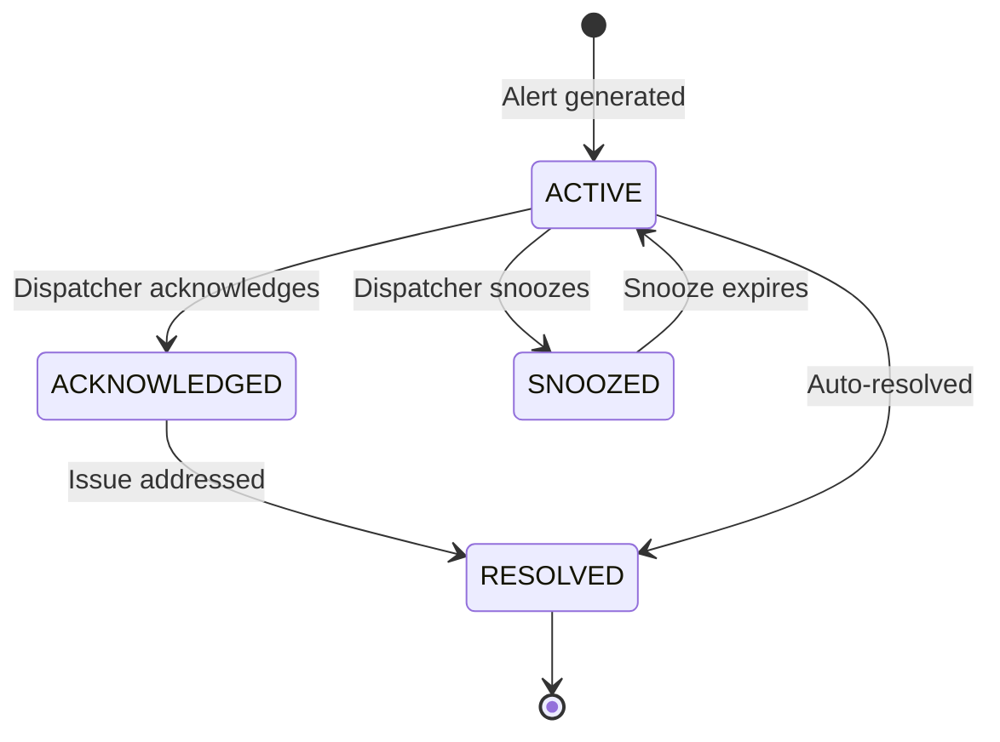

# Alerts and Monitoring

SALLY continuously monitors every active route in your fleet, checking for potential issues every 60 seconds. When something needs attention -- an approaching HOS limit, a route deviation, severe weather ahead, or a dock delay -- SALLY generates an alert and delivers it to dispatchers in real time.

## How Monitoring Works

Once you [activate a route](/getting-started/first-route#step-7-activate-the-route), SALLY's monitoring service begins tracking it across 14 trigger types in 5 categories. The monitoring loop runs continuously:

1. **Check** -- Evaluate driver HOS, vehicle position, weather, and schedule against the active route plan
2. **Detect** -- Identify situations that require dispatcher attention
3. **Alert** -- Generate an alert with category, priority, and recommended actions
4. **Deliver** -- Push the alert via SSE, WebSocket, and the alerts API
5. **Track** -- Record all alerts for audit trail and analytics

## Alert Categories

SALLY organizes alerts into five categories:

| Category | Description | Example Triggers |
|---|---|---|
| `HOS_VIOLATION` | Hours of Service compliance issues | Driver approaching 11-hour drive limit, 14-hour duty limit, 8-hour break requirement |
| `ROUTE_DEVIATION` | Driver has left the planned route | Unplanned stop, wrong turn, significant detour |
| `WEATHER` | Severe weather along the route | Winter storm warning, tornado watch, flooding |
| `MECHANICAL` | Vehicle mechanical issues | Engine fault code, tire pressure warning, DEF level low |
| `SCHEDULING` | Schedule and timing conflicts | Late to appointment, dock delay, delivery window missed |

## Alert Priority Levels

Each alert is assigned a priority that determines how it should be handled:

| Priority | Urgency | Response Time | Examples |
|---|---|---|---|
| `CRITICAL` | Immediate action required | Under 5 minutes | Active HOS violation, accident, vehicle breakdown |
| `HIGH` | Urgent attention needed | Under 15 minutes | Approaching HOS limit (under 30 min), severe weather in path |
| `MEDIUM` | Should be reviewed soon | Under 1 hour | Moderate route deviation, appointment at risk |
| `LOW` | Informational | Next check-in | Minor schedule variance, weather advisory |

## Alert Lifecycle

Every alert moves through a defined status flow:



| Status | Description |
|---|---|
| `ACTIVE` | Alert is new and requires attention |
| `ACKNOWLEDGED` | A dispatcher has seen the alert and is working on it |
| `SNOOZED` | Alert is temporarily hidden (resurfaces after snooze duration) |
| `RESOLVED` | Issue has been addressed or auto-resolved |

Alerts can be auto-resolved by SALLY when the underlying condition clears. For example, if a driver was deviating from the route but returns to the planned path, the route deviation alert resolves automatically.

## Quick Start: Checking for Alerts

List all active alerts for your fleet:

```bash
curl "https://sally-api.apps.appshore.in/api/v1/alerts?status=ACTIVE" \
  -H "X-API-Key: $SALLY_API_KEY"
```

**JavaScript (fetch):**

```javascript
const response = await fetch(
  "https://sally-api.apps.appshore.in/api/v1/alerts?status=ACTIVE",
  {
    headers: { "X-API-Key": process.env.SALLY_API_KEY },
  }
);

const { data: alerts, total } = await response.json();
console.log(`${total} active alerts`);
```

**Response:**

```json
{
  "data": [
    {
      "id": "alt_x1y2z3w4",
      "type": "HOS_APPROACHING_LIMIT",
      "category": "HOS_VIOLATION",
      "priority": "HIGH",
      "status": "ACTIVE",
      "title": "Driver approaching 11-hour drive limit",
      "message": "Mike Johnson (TRK-4821) has 45 minutes of drive time remaining on route rte_f8e7d6c5. Next required stop: Rest area on I-70 near Springfield, OH.",
      "driverId": "drv_a1b2c3d4",
      "routePlanId": "rte_f8e7d6c5",
      "metadata": {
        "currentHoursDriven": 10.25,
        "driveTimeRemaining": 0.75,
        "recommendedAction": "PLAN_REST_STOP"
      },
      "createdAt": "2026-02-10T16:15:00Z"
    }
  ],
  "total": 1,
  "page": 1,
  "pageSize": 20
}
```

## Real-time Alert Delivery

For the best dispatcher experience, subscribe to real-time alerts instead of polling the API:

- **Server-Sent Events (SSE):** `GET /api/v1/sse/alerts` -- One-way stream of alert updates, easy to implement
- **WebSocket:** Socket.io connection -- Bidirectional communication, supports acknowledgment

See [Real-time Events](/api-guides/alerts-monitoring/real-time-events) for implementation details.

## Alert Analytics

SALLY provides analytics endpoints to help you understand alert patterns and improve operations:

```bash
# Get alert statistics
curl "https://sally-api.apps.appshore.in/api/v1/alerts/stats" \
  -H "X-API-Key: $SALLY_API_KEY"
```

**Response:**

```json
{
  "total": 156,
  "byStatus": {
    "ACTIVE": 3,
    "ACKNOWLEDGED": 7,
    "RESOLVED": 142,
    "SNOOZED": 4
  },
  "byCategory": {
    "HOS_VIOLATION": 42,
    "ROUTE_DEVIATION": 28,
    "WEATHER": 15,
    "MECHANICAL": 8,
    "SCHEDULING": 63
  },
  "byPriority": {
    "CRITICAL": 5,
    "HIGH": 31,
    "MEDIUM": 72,
    "LOW": 48
  },
  "averageResponseTimeMinutes": 8.3,
  "averageResolutionTimeMinutes": 34.7
}
```

Additional analytics endpoints:

| Endpoint | Description |
|---|---|
| `GET /api/v1/alerts/analytics/volume` | Alert volume over time |
| `GET /api/v1/alerts/analytics/response-time` | Response time trends |
| `GET /api/v1/alerts/analytics/resolution` | Resolution rate and time |
| `GET /api/v1/alerts/analytics/top-types` | Most common alert types |

## Guides in This Section

- [Alert Types](/api-guides/alerts-monitoring/alert-types) -- Detailed reference for all alert categories and types
- [Real-time Events](/api-guides/alerts-monitoring/real-time-events) -- SSE and WebSocket setup for live alerts
- [Alert Management](/api-guides/alerts-monitoring/alert-management) -- Acknowledge, resolve, snooze, and analyze alerts
