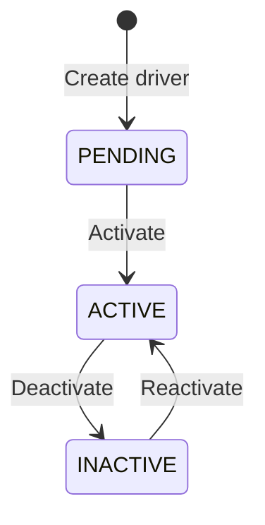

# Drivers API

The Drivers API lets you create and manage driver profiles in your fleet. Each driver record includes personal information, license details, and real-time Hours of Service (HOS) data that SALLY uses for route planning and compliance monitoring.

## Driver Lifecycle

Drivers progress through the following statuses:



| Status | Description |
|---|---|
| `PENDING` | Driver created but not yet cleared for dispatch |
| `ACTIVE` | Driver is available for route assignments |
| `INACTIVE` | Driver is deactivated (leave, termination, etc.) |

Only `ACTIVE` drivers can be assigned to route plans. Attempting to plan a route with an `INACTIVE` or `PENDING` driver returns a `400 Bad Request` error.

## Create a Driver

```bash
curl -X POST https://sally-api.apps.appshore.in/api/v1/drivers \
  -H "X-API-Key: $SALLY_API_KEY" \
  -H "Content-Type: application/json" \
  -d '{
    "firstName": "Sarah",
    "lastName": "Chen",
    "licenseNumber": "C3291-8847-1205",
    "licenseState": "TX",
    "truckNumber": "TRK-7710",
    "phoneNumber": "+1-214-555-0293",
    "email": "sarah.chen@acmefreight.com"
  }'
```

**JavaScript (fetch):**

```javascript
const response = await fetch(
  "https://sally-api.apps.appshore.in/api/v1/drivers",
  {
    method: "POST",
    headers: {
      "X-API-Key": process.env.SALLY_API_KEY,
      "Content-Type": "application/json",
    },
    body: JSON.stringify({
      firstName: "Sarah",
      lastName: "Chen",
      licenseNumber: "C3291-8847-1205",
      licenseState: "TX",
      truckNumber: "TRK-7710",
      phoneNumber: "+1-214-555-0293",
      email: "sarah.chen@acmefreight.com",
    }),
  }
);

const driver = await response.json();
```

**Response:**

```json
{
  "id": "drv_b2c3d4e5",
  "firstName": "Sarah",
  "lastName": "Chen",
  "licenseNumber": "C3291-8847-1205",
  "licenseState": "TX",
  "truckNumber": "TRK-7710",
  "phoneNumber": "+1-214-555-0293",
  "email": "sarah.chen@acmefreight.com",
  "status": "ACTIVE",
  "currentHoursDriven": 0,
  "currentOnDutyTime": 0,
  "currentCycleUsed": 0,
  "lastRestartDate": null,
  "createdAt": "2026-02-10T09:15:00Z",
  "updatedAt": "2026-02-10T09:15:00Z"
}
```

### Required Fields

| Field | Type | Description |
|---|---|---|
| `firstName` | string | Driver's first name |
| `lastName` | string | Driver's last name |
| `licenseNumber` | string | CDL number |
| `licenseState` | string | Two-letter state code where CDL was issued |

### Optional Fields

| Field | Type | Description |
|---|---|---|
| `truckNumber` | string | Assigned truck unit number |
| `phoneNumber` | string | Contact phone number |
| `email` | string | Email address |

## List Drivers

Retrieve all drivers in your fleet with optional filtering:

```bash
curl "https://sally-api.apps.appshore.in/api/v1/drivers?status=ACTIVE&page=1&pageSize=25" \
  -H "X-API-Key: $SALLY_API_KEY"
```

**JavaScript (fetch):**

```javascript
const params = new URLSearchParams({
  status: "ACTIVE",
  page: "1",
  pageSize: "25",
});

const response = await fetch(
  `https://sally-api.apps.appshore.in/api/v1/drivers?${params}`,
  {
    headers: { "X-API-Key": process.env.SALLY_API_KEY },
  }
);

const { data, total, page, pageSize } = await response.json();
```

**Response:**

```json
{
  "data": [
    {
      "id": "drv_a1b2c3d4",
      "firstName": "Mike",
      "lastName": "Johnson",
      "licenseNumber": "D410-7892-4501",
      "licenseState": "IL",
      "truckNumber": "TRK-4821",
      "status": "ACTIVE",
      "currentHoursDriven": 3.5,
      "currentOnDutyTime": 6.2
    },
    {
      "id": "drv_b2c3d4e5",
      "firstName": "Sarah",
      "lastName": "Chen",
      "licenseNumber": "C3291-8847-1205",
      "licenseState": "TX",
      "truckNumber": "TRK-7710",
      "status": "ACTIVE",
      "currentHoursDriven": 0,
      "currentOnDutyTime": 0
    }
  ],
  "total": 2,
  "page": 1,
  "pageSize": 25
}
```

### Filter Parameters

| Parameter | Type | Description |
|---|---|---|
| `status` | string | Filter by status: `ACTIVE`, `INACTIVE`, `PENDING` |
| `search` | string | Search by name, license number, or truck number |
| `page` | number | Page number (default: 1) |
| `pageSize` | number | Results per page (default: 20, max: 100) |

## Get a Single Driver

```bash
curl https://sally-api.apps.appshore.in/api/v1/drivers/drv_a1b2c3d4 \
  -H "X-API-Key: $SALLY_API_KEY"
```

**JavaScript (fetch):**

```javascript
const response = await fetch(
  "https://sally-api.apps.appshore.in/api/v1/drivers/drv_a1b2c3d4",
  {
    headers: { "X-API-Key": process.env.SALLY_API_KEY },
  }
);

const driver = await response.json();
```

**Response:**

```json
{
  "id": "drv_a1b2c3d4",
  "firstName": "Mike",
  "lastName": "Johnson",
  "licenseNumber": "D410-7892-4501",
  "licenseState": "IL",
  "truckNumber": "TRK-4821",
  "phoneNumber": "+1-312-555-0147",
  "email": "mike.johnson@acmefreight.com",
  "status": "ACTIVE",
  "currentHoursDriven": 3.5,
  "currentOnDutyTime": 6.2,
  "currentCycleUsed": 45.5,
  "lastRestartDate": "2026-02-09T06:00:00Z",
  "createdAt": "2026-01-15T10:00:00Z",
  "updatedAt": "2026-02-10T14:30:00Z"
}
```

## Update a Driver

Update mutable fields on a driver profile:

```bash
curl -X PUT https://sally-api.apps.appshore.in/api/v1/drivers/drv_a1b2c3d4 \
  -H "X-API-Key: $SALLY_API_KEY" \
  -H "Content-Type: application/json" \
  -d '{
    "truckNumber": "TRK-5500",
    "phoneNumber": "+1-312-555-0199"
  }'
```

**JavaScript (fetch):**

```javascript
const response = await fetch(
  "https://sally-api.apps.appshore.in/api/v1/drivers/drv_a1b2c3d4",
  {
    method: "PUT",
    headers: {
      "X-API-Key": process.env.SALLY_API_KEY,
      "Content-Type": "application/json",
    },
    body: JSON.stringify({
      truckNumber: "TRK-5500",
      phoneNumber: "+1-312-555-0199",
    }),
  }
);

const updated = await response.json();
```

**Response:**

```json
{
  "id": "drv_a1b2c3d4",
  "firstName": "Mike",
  "lastName": "Johnson",
  "licenseNumber": "D410-7892-4501",
  "licenseState": "IL",
  "truckNumber": "TRK-5500",
  "phoneNumber": "+1-312-555-0199",
  "email": "mike.johnson@acmefreight.com",
  "status": "ACTIVE",
  "updatedAt": "2026-02-10T15:00:00Z"
}
```

## Deactivate a Driver

Deactivating a driver sets their status to `INACTIVE`. They can no longer be assigned to new routes. Active routes are not affected.

```bash
curl -X POST https://sally-api.apps.appshore.in/api/v1/drivers/drv_a1b2c3d4/deactivate \
  -H "X-API-Key: $SALLY_API_KEY"
```

**Response:**

```json
{
  "id": "drv_a1b2c3d4",
  "firstName": "Mike",
  "lastName": "Johnson",
  "status": "INACTIVE",
  "deactivatedAt": "2026-02-10T16:00:00Z"
}
```

You can also use `DELETE /api/v1/drivers/:driver_id` which performs a soft delete (equivalent to deactivation):

```bash
curl -X DELETE https://sally-api.apps.appshore.in/api/v1/drivers/drv_a1b2c3d4 \
  -H "X-API-Key: $SALLY_API_KEY"
```

## Reactivate a Driver

Bring an inactive driver back to active status:

```bash
curl -X POST https://sally-api.apps.appshore.in/api/v1/drivers/drv_a1b2c3d4/reactivate \
  -H "X-API-Key: $SALLY_API_KEY"
```

**Response:**

```json
{
  "id": "drv_a1b2c3d4",
  "firstName": "Mike",
  "lastName": "Johnson",
  "status": "ACTIVE",
  "reactivatedAt": "2026-02-10T17:00:00Z"
}
```

## Get Driver HOS Data

Retrieve the current Hours of Service data for a driver. This is the data SALLY uses to validate compliance when planning routes.

```bash
curl https://sally-api.apps.appshore.in/api/v1/drivers/drv_a1b2c3d4/hos \
  -H "X-API-Key: $SALLY_API_KEY"
```

**JavaScript (fetch):**

```javascript
const response = await fetch(
  "https://sally-api.apps.appshore.in/api/v1/drivers/drv_a1b2c3d4/hos",
  {
    headers: { "X-API-Key": process.env.SALLY_API_KEY },
  }
);

const hos = await response.json();
console.log("Hours remaining:", 11 - hos.currentHoursDriven);
```

**Response:**

```json
{
  "driverId": "drv_a1b2c3d4",
  "driverName": "Mike Johnson",
  "currentHoursDriven": 3.5,
  "currentOnDutyTime": 6.2,
  "currentCycleUsed": 45.5,
  "hoursSinceLastBreak": 3.5,
  "lastRestartDate": "2026-02-09T06:00:00Z",
  "driveTimeRemaining": 7.5,
  "dutyTimeRemaining": 7.8,
  "cycleTimeRemaining": 24.5,
  "breakRequired": false,
  "breakRequiredWithin": 4.5,
  "currentDutyStatus": "ON_DUTY_DRIVING",
  "lastStatusChange": "2026-02-10T10:30:00Z",
  "source": "SAMSARA",
  "lastSyncedAt": "2026-02-10T14:25:00Z"
}
```

### HOS Fields Explained

| Field | Description | FMCSA Limit |
|---|---|---|
| `currentHoursDriven` | Hours spent driving in the current duty period | 11 hours |
| `currentOnDutyTime` | Total on-duty hours (driving + other work) | 14 hours |
| `currentCycleUsed` | Hours used in the 70-hour/8-day cycle | 70 hours |
| `hoursSinceLastBreak` | Time since last qualifying 30-minute break | 8 hours |
| `driveTimeRemaining` | Hours of driving left before 11-hour limit | -- |
| `dutyTimeRemaining` | Hours of on-duty time left before 14-hour limit | -- |
| `cycleTimeRemaining` | Hours left in the 70-hour cycle | -- |
| `breakRequired` | Whether a 30-minute break is immediately required | -- |
| `breakRequiredWithin` | Hours until a break becomes required | -- |
| `currentDutyStatus` | Current ELD status (ON_DUTY_DRIVING, ON_DUTY_NOT_DRIVING, SLEEPER_BERTH, OFF_DUTY) | -- |
| `source` | Where HOS data comes from (SAMSARA, MANUAL, etc.) | -- |

When a Samsara ELD integration is configured, HOS data is synced automatically. Otherwise, you can provide manual HOS state when planning routes.

## Driver-User Linking

Drivers in SALLY can be linked to user accounts with the `DRIVER` role. When a user with the `DRIVER` role logs in, they see the driver-specific view with their assigned routes and HOS information.

The link is established when you create a user invitation with the `DRIVER` role and associate it with a driver profile:

```bash
curl -X POST https://sally-api.apps.appshore.in/api/v1/user-invitations \
  -H "X-API-Key: $SALLY_API_KEY" \
  -H "Content-Type: application/json" \
  -d '{
    "email": "mike.johnson@acmefreight.com",
    "role": "DRIVER",
    "driverId": "drv_a1b2c3d4"
  }'
```

Once the driver accepts the invitation and creates their account, the driver profile is automatically linked.

## Error Responses

### 404 Not Found

```json
{
  "statusCode": 404,
  "message": "Driver with ID drv_invalid not found",
  "error": "Not Found"
}
```

### 400 Bad Request -- Duplicate License

```json
{
  "statusCode": 400,
  "message": "A driver with license number D410-7892-4501 already exists",
  "error": "Bad Request"
}
```

### 400 Bad Request -- Invalid State Transition

```json
{
  "statusCode": 400,
  "message": "Cannot deactivate driver: driver is already INACTIVE",
  "error": "Bad Request"
}
```

## Next Steps

- [Vehicles API](/api-guides/fleet-management/vehicles) -- Manage your vehicle fleet
- [Loads API](/api-guides/fleet-management/loads) -- Create and manage shipment loads
- [Your First Route](/getting-started/first-route) -- Use driver data to plan routes
- [ELD / Samsara Integration](/api-guides/integrations/eld-samsara) -- Automatic HOS data sync
