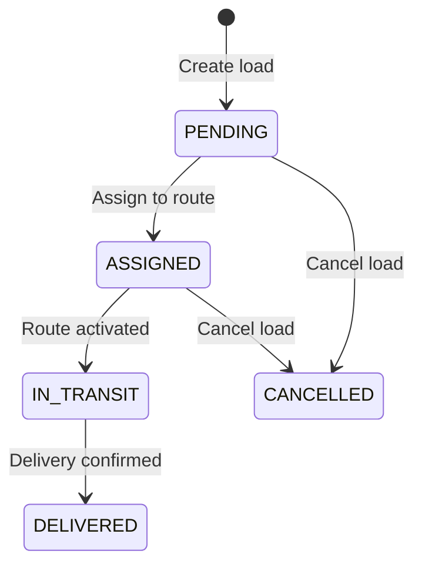

# Loads API

Loads represent individual shipments in SALLY. Each load has an origin, a destination, scheduled pickup/delivery times, and cargo details. When you plan a route, you assign one or more loads to it, and SALLY sequences the stops optimally while maintaining HOS compliance.

## Load Status Flow



| Status | Description |
|---|---|
| `PENDING` | Load created, not yet assigned to a route |
| `ASSIGNED` | Load assigned to a route plan |
| `IN_TRANSIT` | Route is active, load is being transported |
| `DELIVERED` | Load has been delivered to the destination |
| `CANCELLED` | Load cancelled before delivery |

## Create a Load

```bash
curl -X POST https://sally-api.apps.appshore.in/api/v1/loads \
  -H "X-API-Key: $SALLY_API_KEY" \
  -H "Content-Type: application/json" \
  -d '{
    "referenceNumber": "LD-20260210-003",
    "customer": "Great Lakes Manufacturing",
    "originAddress": "1400 E Lake Shore Dr, Cleveland, OH 44114",
    "originCity": "Cleveland",
    "originState": "OH",
    "originZip": "44114",
    "originLat": 41.5074,
    "originLon": -81.6735,
    "destinationAddress": "7200 W 71st St, Bedford Park, IL 60638",
    "destinationCity": "Bedford Park",
    "destinationState": "IL",
    "destinationZip": "60638",
    "destinationLat": 41.7658,
    "destinationLon": -87.7580,
    "scheduledPickup": "2026-02-11T07:00:00Z",
    "scheduledDelivery": "2026-02-11T16:00:00Z",
    "weight": 44000,
    "commodity": "Steel coils",
    "specialInstructions": "Flatbed required. Secure with chains and binders.",
    "status": "PENDING"
  }'
```

**JavaScript (fetch):**

```javascript
const response = await fetch(
  "https://sally-api.apps.appshore.in/api/v1/loads",
  {
    method: "POST",
    headers: {
      "X-API-Key": process.env.SALLY_API_KEY,
      "Content-Type": "application/json",
    },
    body: JSON.stringify({
      referenceNumber: "LD-20260210-003",
      customer: "Great Lakes Manufacturing",
      originAddress: "1400 E Lake Shore Dr, Cleveland, OH 44114",
      originCity: "Cleveland",
      originState: "OH",
      originZip: "44114",
      originLat: 41.5074,
      originLon: -81.6735,
      destinationAddress: "7200 W 71st St, Bedford Park, IL 60638",
      destinationCity: "Bedford Park",
      destinationState: "IL",
      destinationZip: "60638",
      destinationLat: 41.7658,
      destinationLon: -87.7580,
      scheduledPickup: "2026-02-11T07:00:00Z",
      scheduledDelivery: "2026-02-11T16:00:00Z",
      weight: 44000,
      commodity: "Steel coils",
      specialInstructions: "Flatbed required. Secure with chains and binders.",
      status: "PENDING",
    }),
  }
);

const load = await response.json();
```

**Response:**

```json
{
  "id": "load_q7r8s9t0",
  "referenceNumber": "LD-20260210-003",
  "customer": "Great Lakes Manufacturing",
  "originAddress": "1400 E Lake Shore Dr, Cleveland, OH 44114",
  "originCity": "Cleveland",
  "originState": "OH",
  "originZip": "44114",
  "originLat": 41.5074,
  "originLon": -81.6735,
  "destinationAddress": "7200 W 71st St, Bedford Park, IL 60638",
  "destinationCity": "Bedford Park",
  "destinationState": "IL",
  "destinationZip": "60638",
  "destinationLat": 41.7658,
  "destinationLon": -87.7580,
  "scheduledPickup": "2026-02-11T07:00:00Z",
  "scheduledDelivery": "2026-02-11T16:00:00Z",
  "weight": 44000,
  "commodity": "Steel coils",
  "specialInstructions": "Flatbed required. Secure with chains and binders.",
  "status": "PENDING",
  "createdAt": "2026-02-10T10:30:00Z",
  "updatedAt": "2026-02-10T10:30:00Z"
}
```

### Required Fields

| Field | Type | Description |
|---|---|---|
| `referenceNumber` | string | Your internal load/shipment reference number |
| `customer` | string | Customer or shipper name |
| `originAddress` | string | Full pickup address |
| `destinationAddress` | string | Full delivery address |

### Optional Fields

| Field | Type | Description |
|---|---|---|
| `originCity` | string | Pickup city |
| `originState` | string | Pickup state (two-letter code) |
| `originZip` | string | Pickup ZIP code |
| `originLat` | number | Pickup latitude (improves route accuracy) |
| `originLon` | number | Pickup longitude |
| `destinationCity` | string | Delivery city |
| `destinationState` | string | Delivery state (two-letter code) |
| `destinationZip` | string | Delivery ZIP code |
| `destinationLat` | number | Delivery latitude |
| `destinationLon` | number | Delivery longitude |
| `scheduledPickup` | string (ISO 8601) | Scheduled pickup date and time |
| `scheduledDelivery` | string (ISO 8601) | Scheduled delivery date and time |
| `weight` | number | Total weight in pounds |
| `commodity` | string | Description of freight being hauled |
| `specialInstructions` | string | Notes for the driver |
| `status` | string | Initial status (default: `PENDING`) |

Providing `originLat`/`originLon` and `destinationLat`/`destinationLon` coordinates is strongly recommended. If omitted, SALLY geocodes the addresses, which may add latency to route planning requests.

## List Loads

```bash
curl "https://sally-api.apps.appshore.in/api/v1/loads?status=PENDING&page=1&pageSize=25" \
  -H "X-API-Key: $SALLY_API_KEY"
```

**JavaScript (fetch):**

```javascript
const params = new URLSearchParams({
  status: "PENDING",
  page: "1",
  pageSize: "25",
});

const response = await fetch(
  `https://sally-api.apps.appshore.in/api/v1/loads?${params}`,
  {
    headers: { "X-API-Key": process.env.SALLY_API_KEY },
  }
);

const { data, total } = await response.json();
```

**Response:**

```json
{
  "data": [
    {
      "id": "load_i9j0k1l2",
      "referenceNumber": "LD-20260210-001",
      "customer": "Midwest Auto Parts",
      "originCity": "Chicago",
      "originState": "IL",
      "destinationCity": "Indianapolis",
      "destinationState": "IN",
      "scheduledPickup": "2026-02-10T09:00:00Z",
      "scheduledDelivery": "2026-02-10T15:00:00Z",
      "weight": 38500,
      "commodity": "Auto parts",
      "status": "PENDING"
    },
    {
      "id": "load_q7r8s9t0",
      "referenceNumber": "LD-20260210-003",
      "customer": "Great Lakes Manufacturing",
      "originCity": "Cleveland",
      "originState": "OH",
      "destinationCity": "Bedford Park",
      "destinationState": "IL",
      "scheduledPickup": "2026-02-11T07:00:00Z",
      "scheduledDelivery": "2026-02-11T16:00:00Z",
      "weight": 44000,
      "commodity": "Steel coils",
      "status": "PENDING"
    }
  ],
  "total": 2,
  "page": 1,
  "pageSize": 25
}
```

### Filter Parameters

| Parameter | Type | Description |
|---|---|---|
| `status` | string | Filter by status: `PENDING`, `ASSIGNED`, `IN_TRANSIT`, `DELIVERED`, `CANCELLED` |
| `customer` | string | Filter by customer name |
| `search` | string | Search by reference number, customer, or commodity |
| `page` | number | Page number (default: 1) |
| `pageSize` | number | Results per page (default: 20, max: 100) |

## Get a Single Load

```bash
curl https://sally-api.apps.appshore.in/api/v1/loads/load_q7r8s9t0 \
  -H "X-API-Key: $SALLY_API_KEY"
```

**JavaScript (fetch):**

```javascript
const response = await fetch(
  "https://sally-api.apps.appshore.in/api/v1/loads/load_q7r8s9t0",
  {
    headers: { "X-API-Key": process.env.SALLY_API_KEY },
  }
);

const load = await response.json();
```

**Response:**

```json
{
  "id": "load_q7r8s9t0",
  "referenceNumber": "LD-20260210-003",
  "customer": "Great Lakes Manufacturing",
  "originAddress": "1400 E Lake Shore Dr, Cleveland, OH 44114",
  "originCity": "Cleveland",
  "originState": "OH",
  "originZip": "44114",
  "originLat": 41.5074,
  "originLon": -81.6735,
  "destinationAddress": "7200 W 71st St, Bedford Park, IL 60638",
  "destinationCity": "Bedford Park",
  "destinationState": "IL",
  "destinationZip": "60638",
  "destinationLat": 41.7658,
  "destinationLon": -87.7580,
  "scheduledPickup": "2026-02-11T07:00:00Z",
  "scheduledDelivery": "2026-02-11T16:00:00Z",
  "weight": 44000,
  "commodity": "Steel coils",
  "specialInstructions": "Flatbed required. Secure with chains and binders.",
  "status": "PENDING",
  "routePlanId": null,
  "createdAt": "2026-02-10T10:30:00Z",
  "updatedAt": "2026-02-10T10:30:00Z"
}
```

## Update a Load

Modify load details before the load is in transit:

```bash
curl -X PUT https://sally-api.apps.appshore.in/api/v1/loads/load_q7r8s9t0 \
  -H "X-API-Key: $SALLY_API_KEY" \
  -H "Content-Type: application/json" \
  -d '{
    "scheduledDelivery": "2026-02-11T18:00:00Z",
    "weight": 43500,
    "specialInstructions": "Flatbed required. Secure with chains and binders. Dock 7 at destination."
  }'
```

**JavaScript (fetch):**

```javascript
const response = await fetch(
  "https://sally-api.apps.appshore.in/api/v1/loads/load_q7r8s9t0",
  {
    method: "PUT",
    headers: {
      "X-API-Key": process.env.SALLY_API_KEY,
      "Content-Type": "application/json",
    },
    body: JSON.stringify({
      scheduledDelivery: "2026-02-11T18:00:00Z",
      weight: 43500,
      specialInstructions:
        "Flatbed required. Secure with chains and binders. Dock 7 at destination.",
    }),
  }
);

const updated = await response.json();
```

**Response:**

```json
{
  "id": "load_q7r8s9t0",
  "referenceNumber": "LD-20260210-003",
  "customer": "Great Lakes Manufacturing",
  "scheduledDelivery": "2026-02-11T18:00:00Z",
  "weight": 43500,
  "specialInstructions": "Flatbed required. Secure with chains and binders. Dock 7 at destination.",
  "status": "PENDING",
  "updatedAt": "2026-02-10T11:00:00Z"
}
```

If a load is already `ASSIGNED` to a route and you change delivery times or addresses, SALLY's monitoring service will detect the change and trigger a route re-plan automatically.

## Delete (Cancel) a Load

```bash
curl -X DELETE https://sally-api.apps.appshore.in/api/v1/loads/load_q7r8s9t0 \
  -H "X-API-Key: $SALLY_API_KEY"
```

**JavaScript (fetch):**

```javascript
const response = await fetch(
  "https://sally-api.apps.appshore.in/api/v1/loads/load_q7r8s9t0",
  {
    method: "DELETE",
    headers: { "X-API-Key": process.env.SALLY_API_KEY },
  }
);
```

**Response:**

```json
{
  "id": "load_q7r8s9t0",
  "referenceNumber": "LD-20260210-003",
  "status": "CANCELLED",
  "cancelledAt": "2026-02-10T12:00:00Z"
}
```

Cancelling a load that is part of an active route triggers an alert to the dispatcher and may require a route re-plan.

## Load Assignment to Route Plans

Loads are assigned to routes when you include their IDs in the route planning request:

```bash
curl -X POST https://sally-api.apps.appshore.in/api/v1/routes/plan \
  -H "X-API-Key: $SALLY_API_KEY" \
  -H "Content-Type: application/json" \
  -d '{
    "driverId": "drv_a1b2c3d4",
    "vehicleId": "veh_e5f6g7h8",
    "loadIds": ["load_i9j0k1l2", "load_m3n4o5p6"],
    "stops": [...],
    "optimizationPriority": "balance"
  }'
```

When a route is planned:
- Each load's status changes from `PENDING` to `ASSIGNED`
- The `routePlanId` field is populated on the load record
- The load's origin and destination become stops in the route

When the route is activated:
- Each load's status changes from `ASSIGNED` to `IN_TRANSIT`

When the driver confirms delivery at a stop:
- The corresponding load's status changes from `IN_TRANSIT` to `DELIVERED`

## Error Responses

### 404 Not Found

```json
{
  "statusCode": 404,
  "message": "Load with ID load_invalid not found",
  "error": "Not Found"
}
```

### 400 Bad Request -- Duplicate Reference Number

```json
{
  "statusCode": 400,
  "message": "A load with reference number LD-20260210-003 already exists",
  "error": "Bad Request"
}
```

### 400 Bad Request -- Cannot Modify In-Transit Load

```json
{
  "statusCode": 400,
  "message": "Cannot update load: load is currently IN_TRANSIT. Only PENDING and ASSIGNED loads can be modified.",
  "error": "Bad Request"
}
```

## Next Steps

- [Drivers API](/api-guides/fleet-management/drivers) -- Manage your driver fleet
- [Vehicles API](/api-guides/fleet-management/vehicles) -- Register fleet vehicles
- [Your First Route](/getting-started/first-route) -- Combine loads, drivers, and vehicles into routes
- [Route Planning](/api-guides/route-planning/creating-routes) -- Advanced route planning with load optimization
