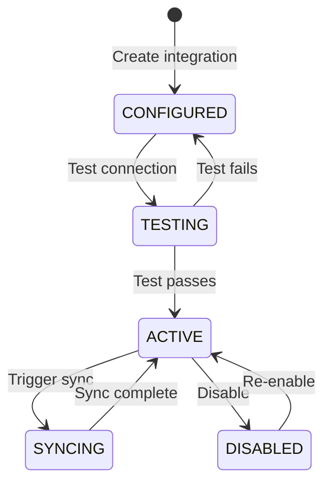

# Integrations

SALLY's integration framework connects your fleet operations with external services -- ELD providers for HOS data, TMS platforms for load management, fuel price feeds, and weather services. Integrations run as managed adapters that SALLY syncs on your behalf.

## Supported Vendors

SALLY provides pre-built adapters for the following vendor categories:

| Category | Vendor | Adapter | Data Provided |
|---|---|---|---|
| ELD / HOS | Samsara | `samsara` | Real-time driver HOS, vehicle location, diagnostics |
| TMS | McLeod | `mcleod` | Load data, dispatch assignments, customer info |
| TMS | Project44 | `project44` | Shipment visibility, ETA predictions, tracking |
| Fuel | GasBuddy | `gasbuddy` | Real-time fuel prices by station and location |
| Weather | OpenWeather | `openweather` | Current conditions, forecasts, severe weather alerts |

## Integration Lifecycle

Every integration follows a standard lifecycle:



| Status | Description |
|---|---|
| `CONFIGURED` | Integration created with credentials, not yet tested |
| `TESTING` | Connection test in progress |
| `ACTIVE` | Integration is live and syncing data |
| `SYNCING` | A data sync is currently in progress |
| `DISABLED` | Integration is paused (credentials preserved) |
| `ERROR` | Last sync or test failed (check error details) |

## List Integrations

View all configured integrations for your tenant:

```bash
curl https://sally-api.apps.appshore.in/api/v1/integrations \
  -H "X-API-Key: $SALLY_API_KEY"
```

**JavaScript (fetch):**

```javascript
const response = await fetch(
  "https://sally-api.apps.appshore.in/api/v1/integrations",
  {
    headers: { "X-API-Key": process.env.SALLY_API_KEY },
  }
);

const { data: integrations } = await response.json();
```

**Response:**

```json
{
  "data": [
    {
      "id": "int_s1a2m3s4",
      "vendor": "samsara",
      "category": "ELD",
      "name": "Samsara ELD",
      "status": "ACTIVE",
      "lastSyncAt": "2026-02-10T16:00:00Z",
      "nextSyncAt": "2026-02-10T16:15:00Z",
      "syncIntervalMinutes": 15,
      "createdAt": "2026-01-15T10:00:00Z"
    },
    {
      "id": "int_g5b6u7d8",
      "vendor": "gasbuddy",
      "category": "FUEL",
      "name": "GasBuddy Fuel Prices",
      "status": "ACTIVE",
      "lastSyncAt": "2026-02-10T12:00:00Z",
      "nextSyncAt": "2026-02-10T18:00:00Z",
      "syncIntervalMinutes": 360,
      "createdAt": "2026-01-20T14:00:00Z"
    }
  ]
}
```

## Vendor Registry

Retrieve the complete list of supported vendors and their configuration requirements:

```bash
curl https://sally-api.apps.appshore.in/api/v1/integrations/vendors \
  -H "X-API-Key: $SALLY_API_KEY"
```

**JavaScript (fetch):**

```javascript
const response = await fetch(
  "https://sally-api.apps.appshore.in/api/v1/integrations/vendors",
  {
    headers: { "X-API-Key": process.env.SALLY_API_KEY },
  }
);

const { data: vendors } = await response.json();
```

**Response:**

```json
{
  "data": [
    {
      "vendor": "samsara",
      "name": "Samsara",
      "category": "ELD",
      "description": "Electronic Logging Device and fleet telematics",
      "requiredFields": ["apiToken"],
      "optionalFields": ["orgId", "syncIntervalMinutes"],
      "defaultSyncInterval": 15,
      "documentationUrl": "https://developers.samsara.com"
    },
    {
      "vendor": "mcleod",
      "name": "McLeod Software",
      "category": "TMS",
      "description": "Transportation Management System",
      "requiredFields": ["apiUrl", "apiKey", "companyId"],
      "optionalFields": ["syncIntervalMinutes"],
      "defaultSyncInterval": 30
    },
    {
      "vendor": "project44",
      "name": "project44",
      "category": "TMS",
      "description": "Advanced visibility and tracking platform",
      "requiredFields": ["clientId", "clientSecret"],
      "optionalFields": ["environment", "syncIntervalMinutes"],
      "defaultSyncInterval": 15
    },
    {
      "vendor": "gasbuddy",
      "name": "GasBuddy",
      "category": "FUEL",
      "description": "Real-time fuel price data",
      "requiredFields": ["apiKey"],
      "optionalFields": ["searchRadiusMiles", "syncIntervalMinutes"],
      "defaultSyncInterval": 360
    },
    {
      "vendor": "openweather",
      "name": "OpenWeather",
      "category": "WEATHER",
      "description": "Weather data and severe weather alerts",
      "requiredFields": ["apiKey"],
      "optionalFields": ["syncIntervalMinutes"],
      "defaultSyncInterval": 60
    }
  ]
}
```

## Create an Integration

Configure a new integration by providing vendor credentials:

```bash
curl -X POST https://sally-api.apps.appshore.in/api/v1/integrations \
  -H "X-API-Key: $SALLY_API_KEY" \
  -H "Content-Type: application/json" \
  -d '{
    "vendor": "samsara",
    "name": "Samsara ELD - Production",
    "config": {
      "apiToken": "samsara_api_XXXXXXXXXXXXXXXXXXXX",
      "orgId": "org_12345"
    },
    "syncIntervalMinutes": 15
  }'
```

**JavaScript (fetch):**

```javascript
const response = await fetch(
  "https://sally-api.apps.appshore.in/api/v1/integrations",
  {
    method: "POST",
    headers: {
      "X-API-Key": process.env.SALLY_API_KEY,
      "Content-Type": "application/json",
    },
    body: JSON.stringify({
      vendor: "samsara",
      name: "Samsara ELD - Production",
      config: {
        apiToken: "samsara_api_XXXXXXXXXXXXXXXXXXXX",
        orgId: "org_12345",
      },
      syncIntervalMinutes: 15,
    }),
  }
);

const integration = await response.json();
```

**Response:**

```json
{
  "id": "int_s1a2m3s4",
  "vendor": "samsara",
  "category": "ELD",
  "name": "Samsara ELD - Production",
  "status": "CONFIGURED",
  "syncIntervalMinutes": 15,
  "createdAt": "2026-02-10T10:00:00Z"
}
```

Credentials are encrypted at rest and never returned in API responses after creation.

## Test a Connection

Before activating an integration, test that the credentials work:

```bash
curl -X POST https://sally-api.apps.appshore.in/api/v1/integrations/int_s1a2m3s4/test \
  -H "X-API-Key: $SALLY_API_KEY"
```

**Response (success):**

```json
{
  "id": "int_s1a2m3s4",
  "testResult": "SUCCESS",
  "message": "Successfully connected to Samsara API. Found 12 vehicles and 8 drivers.",
  "details": {
    "vehiclesFound": 12,
    "driversFound": 8,
    "apiVersion": "v1",
    "latency": "245ms"
  },
  "testedAt": "2026-02-10T10:01:00Z"
}
```

**Response (failure):**

```json
{
  "id": "int_s1a2m3s4",
  "testResult": "FAILED",
  "message": "Authentication failed. The provided API token is invalid or expired.",
  "error": {
    "code": "AUTH_FAILED",
    "details": "Samsara API returned 401 Unauthorized"
  },
  "testedAt": "2026-02-10T10:01:00Z"
}
```

If the test passes, the integration status automatically changes to `ACTIVE` and the first data sync begins.

## Trigger a Manual Sync

Force an immediate data sync outside the scheduled interval:

```bash
curl -X POST https://sally-api.apps.appshore.in/api/v1/integrations/int_s1a2m3s4/sync \
  -H "X-API-Key: $SALLY_API_KEY"
```

**Response:**

```json
{
  "id": "int_s1a2m3s4",
  "status": "SYNCING",
  "syncStartedAt": "2026-02-10T16:05:00Z",
  "message": "Sync initiated. This may take a few minutes depending on data volume."
}
```

## How Data Flows

When an integration syncs, data flows into SALLY and is used by the planning and monitoring engines:

| Integration | Data Synced | Used By |
|---|---|---|
| Samsara (ELD) | Driver HOS hours, vehicle locations, diagnostics | Route planner (HOS validation), monitoring (HOS alerts, vehicle position) |
| McLeod (TMS) | Loads, customers, dispatch assignments | Load management, route planning |
| Project44 (TMS) | Shipment tracking, ETA visibility | Monitoring (schedule alerts) |
| GasBuddy (Fuel) | Fuel prices by station | Route planner (fuel stop optimization) |
| OpenWeather | Weather conditions, forecasts, alerts | Monitoring (weather alerts), route planner (weather-adjusted ETAs) |

## Guides in This Section

- [ELD / Samsara Integration](/api-guides/integrations/eld-samsara) -- Connect Samsara for real-time HOS and telematics
- [TMS Integration](/api-guides/integrations/tms) -- Connect McLeod or Project44 for load management
- [Webhooks](/api-guides/integrations/webhooks) -- Receive event notifications from SALLY
- [Error Handling](/api-guides/integrations/error-handling) -- Handle errors, retries, and rate limits
