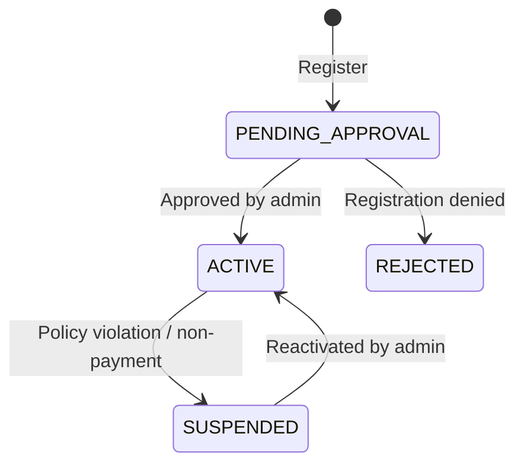

# Tenant Setup

SALLY is a multi-tenant platform. Every organization (carrier, broker, fleet operator) operates within its own isolated tenant. All data -- drivers, vehicles, loads, routes, and alerts -- is automatically scoped to your tenant. Users never see data from other tenants.

## Tenant Lifecycle



| Status | Description |
|---|---|
| `PENDING_APPROVAL` | Registration submitted, awaiting review |
| `ACTIVE` | Tenant is live and fully operational |
| `REJECTED` | Registration was denied |
| `SUSPENDED` | Tenant access temporarily revoked |

## Registration Flow

### Step 1: Register

Create your organization account:

```bash
curl -X POST https://sally-api.apps.appshore.in/api/v1/auth/register \
  -H "Content-Type: application/json" \
  -d '{
    "organization": {
      "name": "Acme Freight Lines",
      "dotNumber": "1234567",
      "mcNumber": "MC-987654",
      "address": "2800 S Western Ave, Chicago, IL 60608",
      "phone": "+1-312-555-0100",
      "contactEmail": "ops@acmefreight.com"
    },
    "adminUser": {
      "firstName": "Robert",
      "lastName": "Williams",
      "email": "robert.williams@acmefreight.com",
      "password": "a_secure_password_here"
    }
  }'
```

**JavaScript (fetch):**

```javascript
const response = await fetch(
  "https://sally-api.apps.appshore.in/api/v1/auth/register",
  {
    method: "POST",
    headers: { "Content-Type": "application/json" },
    body: JSON.stringify({
      organization: {
        name: "Acme Freight Lines",
        dotNumber: "1234567",
        mcNumber: "MC-987654",
        address: "2800 S Western Ave, Chicago, IL 60608",
        phone: "+1-312-555-0100",
        contactEmail: "ops@acmefreight.com",
      },
      adminUser: {
        firstName: "Robert",
        lastName: "Williams",
        email: "robert.williams@acmefreight.com",
        password: "a_secure_password_here",
      },
    }),
  }
);

const result = await response.json();
```

**Response:**

```json
{
  "tenant": {
    "id": "tnt_acme001",
    "name": "Acme Freight Lines",
    "dotNumber": "1234567",
    "mcNumber": "MC-987654",
    "status": "PENDING_APPROVAL",
    "createdAt": "2026-02-10T10:00:00Z"
  },
  "user": {
    "id": "usr_r1w2i3l4",
    "firstName": "Robert",
    "lastName": "Williams",
    "email": "robert.williams@acmefreight.com",
    "role": "OWNER",
    "tenantId": "tnt_acme001"
  },
  "message": "Registration submitted. You will receive an email when your account is approved."
}
```

### Registration Fields

| Field | Required | Description |
|---|---|---|
| `organization.name` | Yes | Legal business name |
| `organization.dotNumber` | No | USDOT number (recommended for carriers) |
| `organization.mcNumber` | No | Motor Carrier number |
| `organization.address` | Yes | Business address |
| `organization.phone` | Yes | Business phone number |
| `organization.contactEmail` | Yes | Primary contact email |
| `adminUser.firstName` | Yes | Admin user's first name |
| `adminUser.lastName` | Yes | Admin user's last name |
| `adminUser.email` | Yes | Admin user's email (used for login) |
| `adminUser.password` | Yes | Admin user's password (min 8 characters) |

The registering user is automatically assigned the `OWNER` role, which has full administrative access to the tenant.

### Step 2: Await Approval

After registration, the tenant enters `PENDING_APPROVAL` status. A SALLY administrator reviews the registration and either approves or rejects it. Approval typically takes less than 24 hours during business days.

You can check your tenant status by logging in:

```bash
curl -X POST https://sally-api.apps.appshore.in/api/v1/auth/login \
  -H "Content-Type: application/json" \
  -d '{
    "email": "robert.williams@acmefreight.com",
    "password": "a_secure_password_here"
  }'
```

**Response while pending:**

```json
{
  "accessToken": "eyJhbGciOiJSUzI1NiIs...",
  "user": {
    "id": "usr_r1w2i3l4",
    "email": "robert.williams@acmefreight.com",
    "role": "OWNER",
    "tenantId": "tnt_acme001",
    "tenantStatus": "PENDING_APPROVAL"
  }
}
```

While the tenant is pending, API access is limited. You can log in and view your profile, but you cannot create drivers, vehicles, loads, or routes until approved.

### Step 3: Activation

Once approved, you receive a confirmation email and the tenant moves to `ACTIVE` status. All API endpoints become fully available.

## Onboarding Steps

After your tenant is approved, complete these steps to start using SALLY:

### 1. Generate API Keys

Create API keys for your integrations:

```bash
curl -X POST https://sally-api.apps.appshore.in/api/v1/api-keys \
  -H "Authorization: Bearer YOUR_JWT_TOKEN" \
  -H "Content-Type: application/json" \
  -d '{
    "name": "Primary Integration Key"
  }'
```

See [API Keys](/getting-started/api-keys) for details.

### 2. Invite Team Members

Add dispatchers, admins, and other team members:

```bash
curl -X POST https://sally-api.apps.appshore.in/api/v1/user-invitations \
  -H "X-API-Key: $SALLY_API_KEY" \
  -H "Content-Type: application/json" \
  -d '{
    "email": "jane.smith@acmefreight.com",
    "role": "DISPATCHER",
    "firstName": "Jane",
    "lastName": "Smith"
  }'
```

**Response:**

```json
{
  "id": "inv_d5e6f7g8",
  "email": "jane.smith@acmefreight.com",
  "role": "DISPATCHER",
  "status": "PENDING",
  "invitedBy": "usr_r1w2i3l4",
  "expiresAt": "2026-02-17T10:00:00Z",
  "createdAt": "2026-02-10T10:00:00Z"
}
```

The invited user receives an email with a link to accept the invitation and create their account. Invitations expire after 7 days.

### 3. Register Fleet

Add your drivers and vehicles:

- [Drivers API](/api-guides/fleet-management/drivers) -- Create driver profiles
- [Vehicles API](/api-guides/fleet-management/vehicles) -- Register trucks

### 4. Configure Integrations

Connect your ELD, TMS, and other systems:

- [ELD / Samsara](/api-guides/integrations/eld-samsara) -- Automatic HOS data
- [TMS Integration](/api-guides/integrations/tms) -- Load sync from McLeod or Project44
- [Integrations Overview](/api-guides/integrations) -- All vendor options

### 5. Plan Your First Route

With drivers, vehicles, and loads in place, plan your first route:

- [Your First Route](/getting-started/first-route) -- Step-by-step tutorial

## Tenant Configuration

Tenants can configure various settings that affect platform behavior. These are accessible to users with the `OWNER` or `ADMIN` role.

### Alert Settings

Configure which alerts your team receives and at what thresholds:

```bash
curl -X PUT https://sally-api.apps.appshore.in/api/v1/tenant/settings/alerts \
  -H "X-API-Key: $SALLY_API_KEY" \
  -H "Content-Type: application/json" \
  -d '{
    "hosApproachingThresholdHours": 1.0,
    "routeDeviationThresholdMiles": 2.0,
    "unplannedStopThresholdMinutes": 15,
    "dockDelayThresholdMinutes": 30,
    "enableWeatherAlerts": true,
    "enableMechanicalAlerts": true
  }'
```

### Monitoring Settings

Configure the monitoring service behavior:

```bash
curl -X PUT https://sally-api.apps.appshore.in/api/v1/tenant/settings/monitoring \
  -H "X-API-Key: $SALLY_API_KEY" \
  -H "Content-Type: application/json" \
  -d '{
    "monitoringIntervalSeconds": 60,
    "autoResolveDeviationAfterMinutes": 10,
    "hosWarningThresholdMinutes": 60
  }'
```

## Data Isolation

Every API request is automatically scoped to your tenant based on the authentication token or API key. You cannot access data belonging to other tenants, and other tenants cannot access your data.

This scoping happens transparently -- you never need to include a tenant ID in your requests. The system resolves it from your credentials.

For example, when you call `GET /api/v1/drivers`, you only see drivers that belong to your organization. If another carrier also has a driver named "Mike Johnson", their driver record is completely invisible to you.

## Suspended Tenants

If your tenant is suspended (due to billing issues, policy violations, or administrative action):

- All API requests return `403 Forbidden` with a message explaining the suspension
- Active routes continue to be monitored but no new routes can be created
- Existing data is preserved and becomes accessible again upon reactivation
- Contact support to understand the reason for suspension and steps to resolve it

```json
{
  "statusCode": 403,
  "message": "Tenant tnt_acme001 is suspended. Contact support@sally.appshore.in for assistance.",
  "error": "Forbidden"
}
```

## Next Steps

- [User Roles and Permissions](/api-guides/multi-tenancy/user-roles) -- Understand the role hierarchy
- [API Keys](/getting-started/api-keys) -- Generate keys for your integrations
- [Your First Route](/getting-started/first-route) -- Start planning routes
