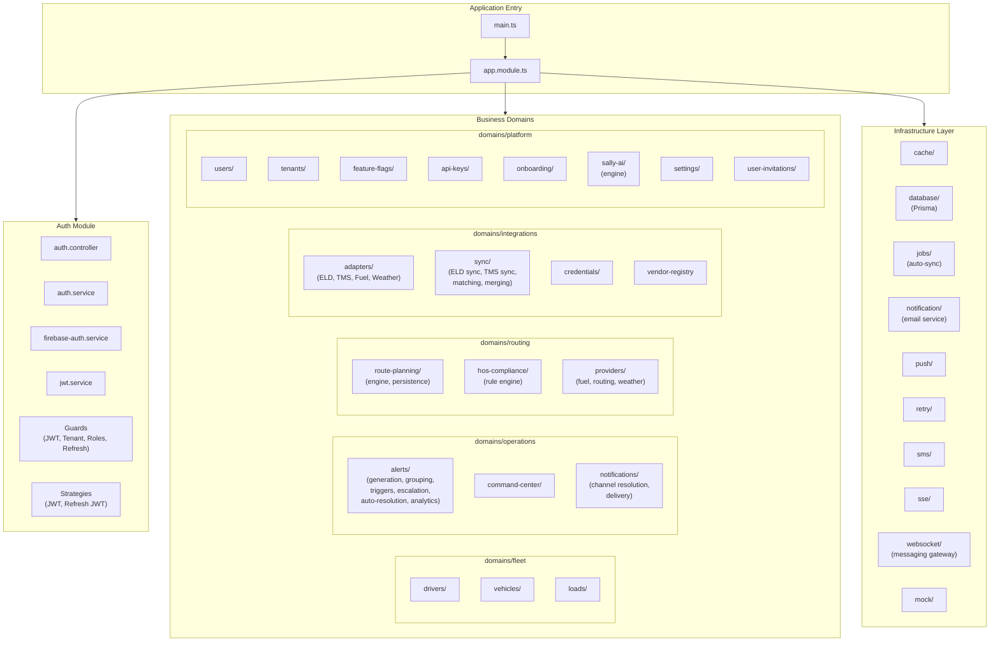
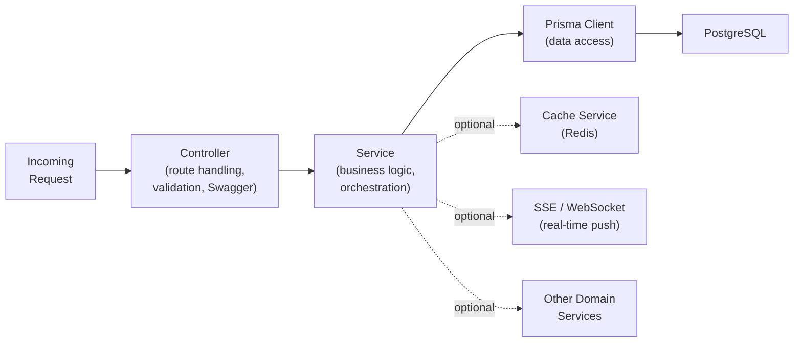
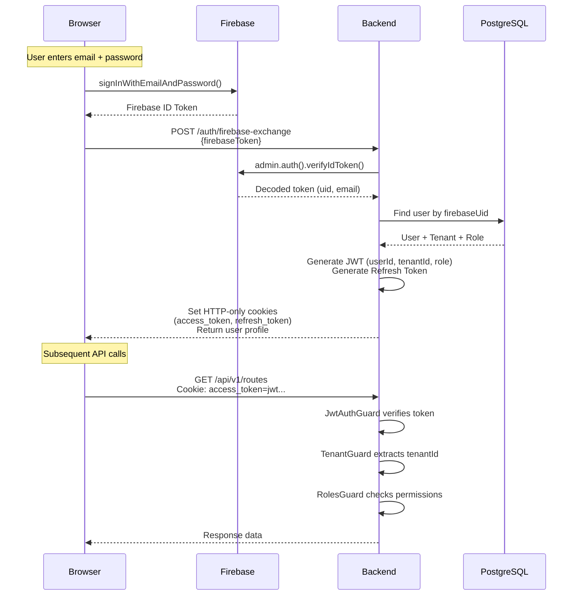
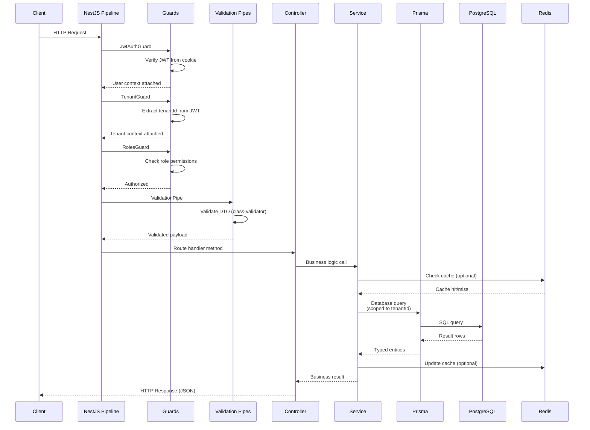
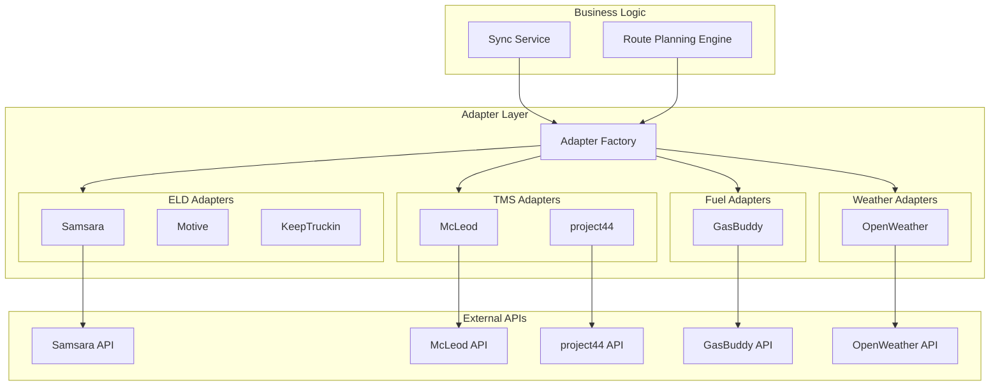

# Backend Architecture

The SALLY backend is a NestJS 11 application organized around domain-driven design principles. Each business domain maps to a NestJS module with its own controllers, services, and data access patterns. The backend exposes a REST API on port 8000, serves real-time events over SSE and WebSocket, and runs background jobs for integration syncing.

---

## Domain Structure

The backend source tree (`apps/backend/src/`) is organized into five business domains, an auth module, a shared module, and an infrastructure layer.



### Domain Responsibilities

**Fleet** (`domains/fleet/`) manages the core fleet entities: drivers, vehicles, and loads. Each has a module with a controller and service. Drivers carry HOS state fields that the routing engine reads directly. Vehicles track fuel capacity and specs. Loads represent freight with pickup/delivery stops and appointment windows.

**Operations** (`domains/operations/`) handles everything that happens after a route is active. The alerts module is the largest in the system, with dedicated services for generation, grouping, triggers, escalation, auto-resolution, caching, analytics, digests, and statistics. The command center provides a unified view of active operations. The notifications module resolves which delivery channel (email, SMS, push, in-app) to use per alert priority and user preferences, then dispatches through the infrastructure layer.

**Routing** (`domains/routing/`) contains the route planning engine and HOS compliance engine. The route planning module has a controller, an engine service (the core planning pipeline), and a persistence service for saving plans and segments. The HOS compliance module contains the rule engine that enforces FMCSA regulations. The providers subdirectory abstracts external data sources (fuel prices, routing distances, weather) behind interfaces, allowing adapter swaps without changing planning logic.

**Integrations** (`domains/integrations/`) manages connections to external systems. The adapter layer defines interfaces for each integration type (ELD, TMS, Fuel, Weather) with concrete implementations (Samsara, McLeod, project44, GasBuddy, OpenWeather). The sync layer runs scheduled pulls from external systems, matching incoming records to local entities and merging updates. The vendor registry catalogs all supported vendors with their credential requirements.

**Platform** (`domains/platform/`) provides cross-cutting platform capabilities: user management, tenant administration, feature flags, API keys, onboarding flows, settings (user preferences, driver preferences, fleet operations settings), user invitations, and the SALLY AI conversational assistant.

---

## Module Structure Pattern

Every domain module follows a consistent internal pattern:



**Controllers** handle HTTP concerns: request routing, DTO validation (via Pipes), Swagger documentation, and response formatting. They contain no business logic.

**Services** contain all business logic. They orchestrate between Prisma for data access, Redis for caching, and other domain services for cross-cutting operations. Services are injectable and can be consumed by other modules.

**Prisma** acts as the data access layer. Rather than a separate repository pattern, services query Prisma Client directly, benefiting from its type-safe, auto-generated API. The `PrismaService` (in `infrastructure/database/`) extends Prisma Client with connection lifecycle management.

---

## Authentication Flow

SALLY uses a two-stage authentication flow: Firebase handles identity verification on the client, then the backend exchanges the Firebase token for its own JWT.



### Guard Chain

Every authenticated request passes through a chain of guards before reaching the controller:

1. **JwtAuthGuard** -- Extracts the JWT from the HTTP-only cookie, verifies its signature and expiration, and attaches the decoded user to the request.
2. **TenantGuard** -- Reads the `tenantId` from the JWT claims and attaches it to the request context. All subsequent database queries are scoped to this tenant.
3. **RolesGuard** -- Checks whether the user's role (DISPATCHER, DRIVER, ADMIN, OWNER, SUPER_ADMIN) has permission for the requested operation.

Some endpoints use the `@Public()` decorator to bypass authentication (login, registration, health checks). The `RefreshJwtAuthGuard` handles token refresh using a separate JWT strategy with longer expiration.

---

## Infrastructure Layer

The infrastructure layer provides shared technical capabilities consumed by domain modules.

### Cache (`infrastructure/cache/`)

Wraps Redis with a NestJS module. Domain services use it for:
- HOS state caching (avoids database reads during planning)
- Alert count aggregations for dashboard widgets
- Integration health status

### Database (`infrastructure/database/`)

Provides the `PrismaService` that extends Prisma Client. Manages connection pooling, graceful shutdown, and logging. All domain services inject `PrismaService` for data access.

### Jobs (`infrastructure/jobs/`)

Scheduled background tasks using NestJS `@Cron` decorators. The primary job is `auto-sync`, which triggers integration sync cycles on configured intervals per tenant.

### Notification Channels

Multiple delivery mechanisms, each in its own infrastructure module:

| Module | Protocol | Use Case |
|---|---|---|
| `notification/` | Email (via service) | Invitation emails, alert digests, tenant notifications |
| `push/` | Web Push (VAPID) | Browser push notifications for alerts |
| `sms/` | SMS | Critical alert delivery to dispatchers on-call |
| `sse/` | Server-Sent Events | Live alert stream to dispatcher dashboard |
| `websocket/` | WebSocket (Socket.IO) | Bidirectional messaging between dispatcher and driver |

### SSE vs WebSocket

SALLY uses both real-time protocols for different purposes:

- **SSE** (`sse/`) -- Unidirectional server-to-client push. Used for streaming alerts, route status updates, and integration sync progress to the dispatcher dashboard. Clients connect to `GET /sse/events` and receive a continuous event stream.
- **WebSocket** (`websocket/`) -- Bidirectional communication. Used for the messaging gateway between dispatchers and drivers, where both sides send and receive messages in real-time.

### Retry (`infrastructure/retry/`)

Provides retry logic with exponential backoff for external API calls (integration adapters, notification delivery). Prevents transient failures from cascading into data inconsistencies.

### Mock (`infrastructure/mock/`)

Mock implementations of external services for development and testing. Allows the full planning pipeline to run without real API credentials.

---

## Request Lifecycle

A complete request through the SALLY backend traverses these layers in order:



### Key Points

- **Tenant scoping is automatic.** The TenantGuard extracts `tenantId` from the JWT, and services include it in every Prisma query. A dispatcher from Carrier A never sees Carrier B's data.
- **Validation happens before controllers.** NestJS's `ValidationPipe` with `class-validator` decorators on DTOs rejects malformed requests before any business logic runs.
- **Caching is selective.** Only hot-path data (HOS states, alert counts) is cached in Redis. Most queries go directly to PostgreSQL through Prisma.

---

## Multi-Tenancy Implementation

SALLY is a multi-tenant platform where each trucking carrier operates in complete isolation.

### Data Isolation

Every major table in the database includes a `tenantId` foreign key referencing the `tenants` table. The TenantGuard extracts the tenant from the authenticated user's JWT, and services inject this into all queries:

```
// Every query is scoped
prisma.driver.findMany({
  where: { tenantId: currentUser.tenantId }
})
```

### Tenant Lifecycle

Tenants progress through a defined lifecycle managed by the `tenants` module:

| Status | Meaning |
|---|---|
| `PENDING_APPROVAL` | Carrier registered, awaiting super-admin review |
| `ACTIVE` | Approved and operational |
| `REJECTED` | Registration denied (with reason) |
| `SUSPENDED` | Temporarily disabled (with reason, can be reactivated) |

### Role Hierarchy

Each user has exactly one role within their tenant:

| Role | Scope | Capabilities |
|---|---|---|
| `SUPER_ADMIN` | Cross-tenant | Approve/reject tenants, system configuration |
| `OWNER` | Single tenant | Full tenant administration, cannot be deleted |
| `ADMIN` | Single tenant | User management, settings, integrations |
| `DISPATCHER` | Single tenant | Route planning, alert management, fleet operations |
| `DRIVER` | Single tenant | View assigned routes, send status updates |

---

## Integration Adapter Pattern

External integrations follow an adapter pattern that decouples business logic from vendor-specific APIs.



Each integration type defines an interface (e.g., `EldAdapterInterface`, `TmsAdapterInterface`). The `AdapterFactoryService` selects the correct implementation based on the tenant's configured vendor. This means adding a new ELD vendor requires only implementing the interface -- no changes to planning or sync logic.

The vendor registry (`vendor-registry.ts`) catalogs all supported vendors with their display names, credential field requirements, and help URLs. The onboarding flow reads this registry to render vendor-specific configuration forms.

---

## Further Reading

- [System Overview](/architecture) -- High-level containers and three-layer architecture
- [Frontend Architecture](/architecture/frontend) -- How the Next.js frontend consumes the backend API
- [Database Schema](/architecture/database) -- Table structure that the backend's Prisma layer queries
- [Data Flow](/architecture/data-flow) -- End-to-end request flows through the backend
