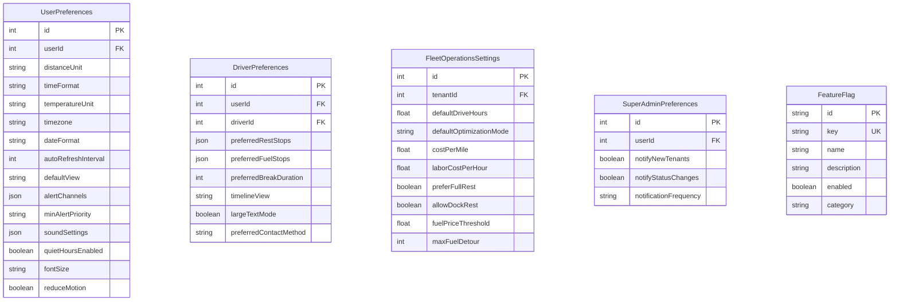

# Database Schema

SALLY uses PostgreSQL 16 as its primary data store, managed through Prisma ORM. The schema contains 25+ tables organized into seven functional groups, with row-level multi-tenancy isolation across all major entities. Prisma Migrate manages schema evolution with 19 migrations to date.

---

## Entity Relationship Overview

The following diagram shows the primary entities and their relationships. For clarity, audit fields (`createdAt`, `updatedAt`) and indexes are omitted.

---

## Table Groups

### 1. Multi-Tenancy and Authentication

These tables form the identity and access layer. Every user belongs to exactly one tenant, and the tenant's status governs whether its users can access the system.

**Key design decisions:**

- **`Tenant.tenantId`** is a human-readable string identifier (e.g., `acme-trucking`), separate from the auto-incrementing `id` used for foreign keys. The `tenantId` string appears in logs and URLs; the integer `id` is used for joins.
- **`User.firebaseUid`** links the local user record to Firebase Auth. This is nullable to support users created before Firebase integration or through API key authentication.
- **`User.driverId`** is an optional link. Only users with the `DRIVER` role have a linked driver record. This allows a driver to exist in the fleet (synced from ELD) before they have a login account.
- **Soft deletes** on users (`deletedAt`, `deletedBy`, `deletionReason`) preserve audit trails while removing access.
- **Invitations** use a unique token with an expiration. When accepted, the invitation links to the newly created user via `acceptedByUserId`.

### 2. Fleet

Fleet tables model the physical assets and freight that SALLY plans routes for.

**Key design decisions:**

- **`Driver` carries HOS state directly.** Rather than a separate HOS table, the driver record contains structured HOS fields (`currentHoursDriven`, `currentOnDutyTime`, `currentHoursSinceBreak`, `cycleHoursUsed`, `cycleDaysData`, `lastRestartAt`). The route planning engine reads these fields directly to simulate compliance. This design avoids an extra join on every planning request.
- **`Stop` is shared across loads.** A physical location (warehouse, fuel station, truck stop) exists once in the `stops` table and is referenced by many loads through the `load_stops` junction table. This prevents duplicate location data.
- **`LoadStop.actionType`** distinguishes pickup vs delivery at each stop, which determines dock time and appointment window handling.
- **External sync fields** (`externalDriverId`, `externalSource`, `lastSyncedAt`, `syncStatus`) appear on drivers, vehicles, and loads. These track which external system the record originated from and when it was last synchronized, enabling conflict detection during sync.

### 3. Route Planning

Route planning tables capture the output of the planning engine: the plan, its ordered segments, links to loads, and the history of updates.

**Key design decisions:**

- **`RouteSegment.segmentType`** distinguishes the nature of each segment: `drive` (movement between points), `rest` (mandatory rest period), `fuel` (fuel stop), `dock` (loading/unloading at a stop). The planning engine inserts rest and fuel segments between drive segments as needed.
- **`RouteSegment.hosStateAfter`** is a JSON snapshot of the driver's HOS clocks at the end of the segment. This allows the frontend to render an HOS timeline without recalculating compliance.
- **`RoutePlan.planVersion`** increments each time the route is re-planned. The `RoutePlanUpdate` table records what triggered each version change and what the impact was (e.g., "ETA delayed 2 hours due to weather").
- **`RoutePlan.dailyBreakdown`** is a JSON field containing a per-day summary (drive hours, rest hours, miles, stops) for multi-day routes. This avoids expensive aggregation queries for the dispatcher dashboard.
- **`RoutePlanLoad`** is a many-to-many junction table allowing a single route plan to carry multiple loads (consolidation scenarios).
- **`RouteSegment.routeGeometry`** stores the encoded polyline for rendering the segment on a map without re-querying the routing engine.

### 4. Operations

Operations tables manage the alert lifecycle and dispatcher coordination.

**Key design decisions:**

- **`Alert.dedupKey`** prevents duplicate alerts. When the same condition fires repeatedly (e.g., "HOS approaching limit" every monitoring cycle), the dedup key ensures only one active alert exists. New occurrences update the existing alert's metadata.
- **`Alert.groupKey`** clusters related alerts. For example, all alerts for a single driver on a single route share a group key, allowing the dashboard to collapse them into a single expandable row.
- **`Alert.parentAlertId`** creates a hierarchy. A "route delay" alert might have child alerts for "appointment at risk" at each affected stop.
- **`Alert.escalationLevel`** tracks how many times an alert has been escalated. Unacknowledged alerts escalate on a configurable schedule (defined in `AlertConfiguration.escalationPolicy`).
- **`AlertConfiguration`** is per-tenant (one row per tenant). It stores JSON configurations for which alert types are enabled, escalation timing, grouping rules, and default notification channels per priority.
- **`ShiftNote`** provides dispatcher-to-dispatcher handoff notes that expire at the end of a shift.

### 5. Notifications

The notification model supports four channels (EMAIL, SMS, PUSH, IN_APP) and 18+ notification types spanning tenant lifecycle, route events, team events, operations, and communications. In-app notifications include `readAt` and `dismissedAt` timestamps for inbox management, plus `actionUrl` and `actionLabel` for deep-linking to the relevant page.

### 6. Integrations

**Key design decisions:**

- **Five integration types** are supported: `TMS`, `HOS_ELD`, `FUEL_PRICE`, `WEATHER`, `TELEMATICS`.
- **Nine vendors** are registered: McLeod TMS, TMW TMS, project44 TMS, Samsara ELD, KeepTruckin ELD, Motive ELD, GasBuddy Fuel, FuelFinder Fuel, OpenWeather.
- **Credentials are stored as JSON** in the `credentials` field. The field is encrypted at rest. Each vendor requires different credential fields (API key, client ID/secret, base URL), defined in the vendor registry.
- **`IntegrationConfig` has a unique constraint** on `(tenantId, integrationType, vendor)`, ensuring each tenant has at most one configuration per vendor per type.
- **Sync logs** provide a detailed audit trail of every sync attempt, including records processed, created, updated, and any errors encountered.

### 7. Settings and Preferences

The settings layer operates at three levels:

- **Tenant level** (`FleetOperationsSettings`) -- Defaults for the entire carrier: HOS defaults, optimization mode, cost rates, rest/fuel preferences. One row per tenant.
- **User level** (`UserPreferences`) -- Individual display and notification preferences: units, timezone, alert channels, quiet hours, accessibility. One row per user.
- **Driver level** (`DriverPreferences`) -- Driver-specific preferences: preferred stops, break duration, mobile display settings, contact method. One row per driver user.
- **Feature flags** (`FeatureFlag`) -- System-wide toggles for progressive feature rollout, categorized as `general`, `dispatcher`, `driver`, or `admin`.

### 8. AI Conversations

The SALLY AI assistant stores conversation history per user within their tenant. Messages include the `role` (user or assistant), `inputMode` (text or voice), detected `intent`, optional `card` (structured UI response), and `action` (actionable commands the AI can trigger).

---

## Multi-Tenancy Pattern

Every major table includes a `tenantId` foreign key referencing the `tenants` table. This provides row-level data isolation between carriers.

**Enforcement happens at two levels:**

1. **Application level** -- The `TenantGuard` in the NestJS backend extracts `tenantId` from the authenticated user's JWT and injects it into the request context. Every service query includes `where: { tenantId }`.
2. **Database level** -- Composite indexes on `(tenantId, ...)` ensure tenant-scoped queries are fast. The unique constraint `@@unique([driverId, tenantId])` on drivers prevents cross-tenant ID collisions.

**Tables without tenantId:**

A few tables are intentionally tenant-agnostic:

- `stops` -- Physical locations can be shared across carriers (same warehouse, same truck stop). The optional `tenantId` on stops allows tenant-specific locations when needed.
- `events` -- System-level event log.
- `recommendations` -- Legacy table from early REST optimization prototyping.
- `feature_flags` -- System-wide toggles, not tenant-specific.

---

## HOS Data on the Driver Table

The driver table's HOS fields deserve special attention because they are the most frequently read data in the system -- every route planning request starts by reading the driver's current HOS state.

| Field | Type | Description |
|---|---|---|
| `currentHoursDriven` | Float | Hours driven in current duty period (11-hour limit) |
| `currentOnDutyTime` | Float | Total on-duty hours in current period (14-hour limit) |
| `currentHoursSinceBreak` | Float | Hours since last 30-minute break (8-hour limit) |
| `cycleHoursUsed` | Float | Hours used in current 70-hour/8-day cycle |
| `cycleDaysData` | JSON | Per-day breakdown of cycle hours for recap calculation |
| `lastRestartAt` | DateTime | When the driver last took a 34-hour restart |
| `homeTerminalTimezone` | String | Driver's home terminal timezone for midnight calculations |
| `hosData` | JSON | Raw HOS data as received from the ELD integration |
| `hosManualOverride` | JSON | Dispatcher-entered override values (with audit fields) |
| `eldMetadata` | JSON | Vendor-specific metadata from the ELD provider |

**Data flow:**

1. The ELD sync job pulls HOS clocks from the external ELD system (e.g., Samsara).
2. The sync service writes both the raw data (`hosData`) and the normalized structured fields (`currentHoursDriven`, etc.).
3. The route planning engine reads the structured fields directly -- no transformation needed at planning time.
4. Dispatchers can set manual overrides (`hosManualOverride`) when the ELD data is stale or incorrect, with full audit tracking (`hosOverrideBy`, `hosOverrideAt`, `hosOverrideReason`).

---

## Indexing Strategy

The schema uses targeted indexes for the most common query patterns:

| Table | Index | Supports |
|---|---|---|
| `alerts` | `(tenantId, status, priority, createdAt)` | Dispatcher dashboard: active alerts sorted by priority |
| `alerts` | `(dedupKey, status)` | Deduplication check during alert generation |
| `alerts` | `(driverId, status)` | Driver-specific alert lookup |
| `users` | `(tenantId)`, `(email)`, `(firebaseUid)` | Login, tenant-scoped user lists |
| `drivers` | `(tenantId)`, `(externalDriverId)`, `(status)` | Fleet pages, ELD sync matching |
| `route_plans` | `(tenantId)`, `(driverId)`, `(isActive)` | Active routes dashboard |
| `route_segments` | `(planId, sequenceOrder)` | Ordered segment retrieval for route display |
| `notifications` | `(userId, readAt, dismissedAt)` | Unread notification count |
| `integration_sync_logs` | `(integrationId, startedAt)` | Sync history for integration health page |

---

## Migration Strategy

SALLY uses Prisma Migrate for schema evolution. The `apps/backend/prisma/migrations/` directory contains 19 sequential migrations, each representing a schema change deployed to all environments.

**Migration workflow:**

1. Modify `schema.prisma`
2. Run `npx prisma migrate dev --name descriptive-name` to generate the migration SQL
3. Review the generated SQL in the migrations directory
4. Commit both the schema change and the migration file
5. In production, `npx prisma migrate deploy` applies pending migrations

**Conventions:**

- Migration names describe the change: `add-alert-configurations`, `add-driver-hos-fields`, `add-push-subscriptions`.
- Destructive changes (column drops, type changes) are handled in separate migrations with data backfill steps.
- The `@map` decorator on every field ensures PostgreSQL column names use `snake_case` while Prisma models use `camelCase`.

---

## Further Reading

- [System Overview](/architecture) -- How the database fits into the overall platform
- [Backend Architecture](/architecture/backend) -- The Prisma service layer that queries these tables
- [Data Flow](/architecture/data-flow) -- How data moves through the system and into these tables
