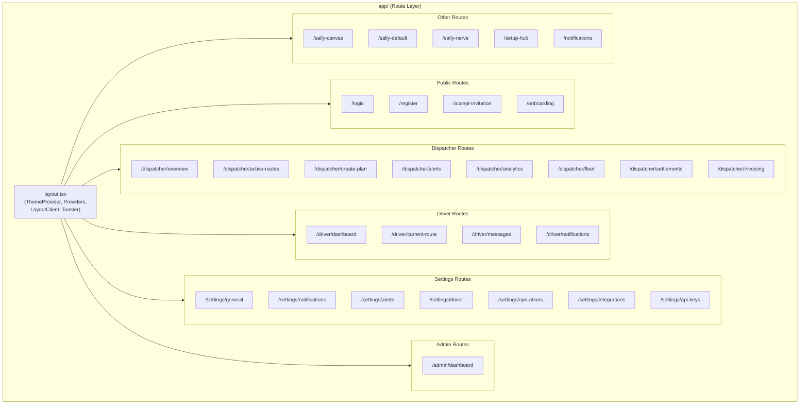
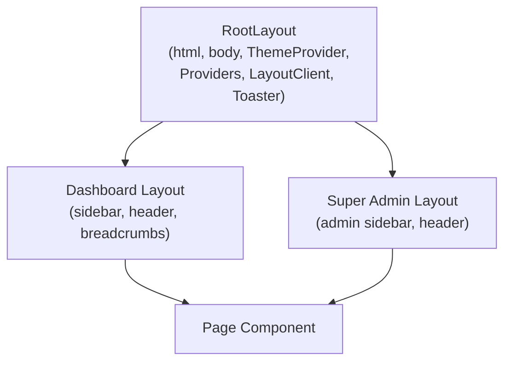
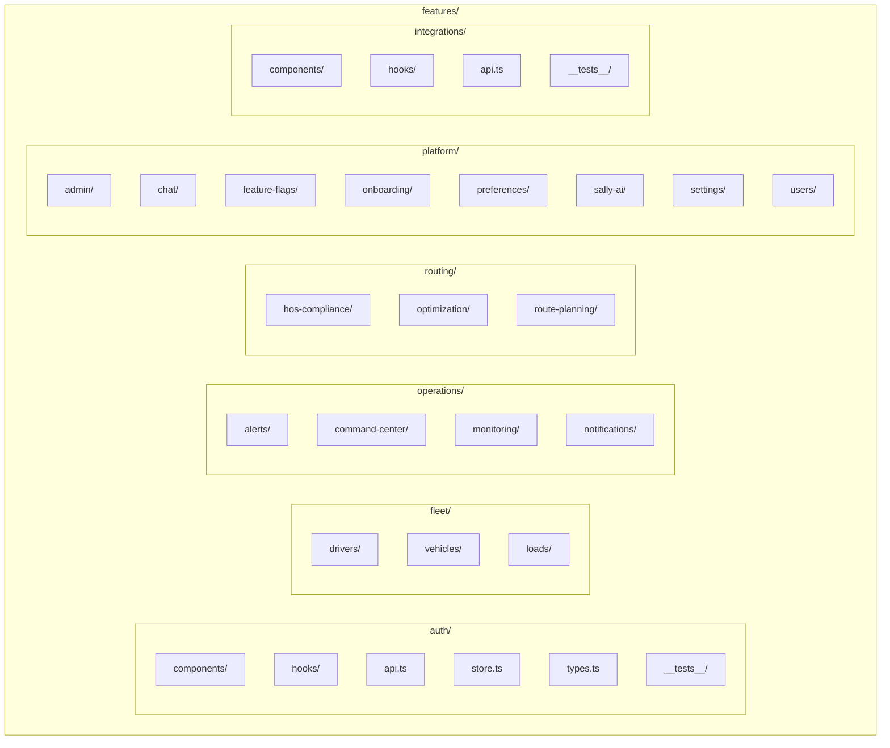
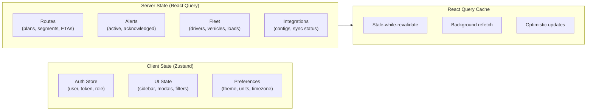
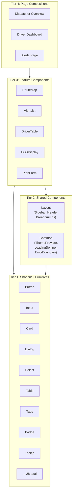
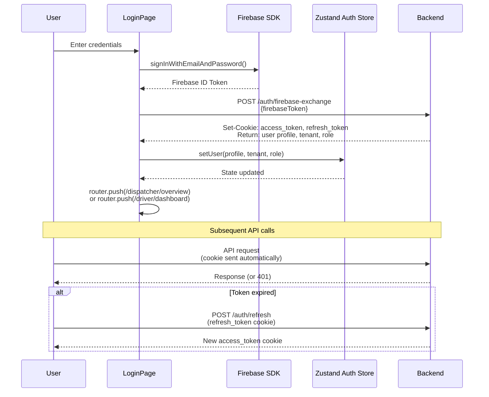

# Frontend Architecture

The SALLY frontend is a Next.js 15 application using the App Router, TypeScript, Tailwind CSS, and Shadcn/ui. It serves two distinct user experiences -- a dispatcher dashboard for fleet operations management and a driver view for route guidance -- from a single codebase using route groups and shared components.

---

## App Router Structure

The frontend source tree (`apps/web/src/`) separates routing (the `app/` directory) from business logic (the `features/` directory) and shared infrastructure (the `shared/` directory).

### Route Groups

The app uses Next.js route groups (directories in parentheses) to apply different layouts without affecting the URL:

- **`(dashboard)`** -- Wraps dispatcher and standard user routes with the main application shell (sidebar navigation, header, notification bar).
- **`(super-admin)`** -- Wraps the super-admin dashboard with an admin-specific layout.

These route groups share the root layout (`layout.tsx`), which provides the theme provider, global providers (React Query, auth), and the toaster for notifications.

### Layout Hierarchy

The `LayoutClient` component handles client-side layout concerns: detecting the current route to determine which navigation to render, managing sidebar open/close state, and handling responsive breakpoint transitions.

---

## Feature Module Pattern

Business logic lives in the `features/` directory, organized to mirror the backend's domain structure. Each feature module is self-contained with its own components, hooks, API functions, types, and tests.

### Module Internals

Each feature module follows a consistent structure:

| File/Directory | Purpose |
|---|---|
| `components/` | React components specific to this feature |
| `hooks/` | Custom hooks (React Query queries, mutations, local state) |
| `api.ts` | API client functions (fetch wrappers for backend endpoints) |
| `types.ts` | TypeScript interfaces and types for this domain |
| `store.ts` | Zustand store slice (only where client-side state is needed) |
| `index.ts` | Public API barrel export |
| `__tests__/` | Unit and integration tests |

**Pages are thin.** Route pages in the `app/` directory import feature components and compose them. Business logic, data fetching, and state management stay in the feature modules.

---

## State Management Strategy

SALLY uses a deliberate split between client state and server state, managed by different libraries optimized for each concern.

### Zustand (Client State)

Zustand stores hold state that originates on the client and does not need to be synchronized with the server:

- **Auth store** -- Current user profile, authentication status, active role. Populated after login, cleared on logout.
- **UI state** -- Sidebar open/close, active modal, selected filters, map viewport. Ephemeral state that resets on navigation.
- **Preferences** -- Cached user preferences (theme, distance units, time format). Loaded once from the server, then managed locally with periodic sync-back.

Zustand is chosen over React Context for its minimal boilerplate, ability to access state outside React components, and built-in support for selective re-rendering.

### React Query (Server State)

React Query manages all data that lives on the server:

- **Queries** fetch data with automatic caching, background refetching, and stale-while-revalidate. For example, the alerts list refreshes every 30 seconds to reflect new alerts.
- **Mutations** handle create/update/delete operations with optimistic updates. When a dispatcher acknowledges an alert, the UI updates immediately while the API call happens in the background.
- **Query invalidation** ensures consistency. When a new route is planned, React Query invalidates the active routes list and driver availability queries.

### When to Use Which

| Scenario | Tool | Example |
|---|---|---|
| Data from the server | React Query | Route plans, alert lists, driver records |
| Data from the client | Zustand | Sidebar state, selected map marker |
| Data from server, rarely changes | Zustand (cached) | User preferences, feature flags |
| Form state | React Hook Form | Route planning form, settings forms |

---

## Component Hierarchy

Components are organized in three tiers, with strict dependency rules: lower tiers never import from higher tiers.

**Tier 1: Shadcn/ui Primitives** (`shared/components/ui/`) -- 28 accessible, themeable base components. These are installed via the Shadcn CLI and customized through CSS variables. They handle dark mode, focus management, and keyboard navigation out of the box.

**Tier 2: Shared Components** (`shared/components/`) -- Application-level shared components built on Tier 1 primitives. The layout module provides the sidebar, header, and breadcrumb components. The common module provides the theme provider, loading states, and error boundaries.

**Tier 3: Feature Components** (`features/*/components/`) -- Domain-specific components that combine Tier 1 and Tier 2 components with business logic. An `AlertList` component composes `Table`, `Badge`, and `Button` from Tier 1, adds alert-specific logic from its feature hooks, and renders within the shared layout from Tier 2.

**Tier 4: Page Compositions** (`app/*/page.tsx`) -- Route pages that compose feature components into a complete view. Pages are intentionally thin -- they import feature components and pass route-level props (params, search params).

---

## Authentication Flow

The frontend handles its half of the two-stage authentication:

**Key implementation details:**

- Firebase SDK runs entirely on the client. The backend never sees the user's password.
- After token exchange, the backend sets HTTP-only cookies (`access_token`, `refresh_token`). The frontend never directly handles JWTs.
- The auth store tracks login state for UI rendering (showing/hiding nav items, redirecting). The actual authorization happens server-side via cookie-based JWTs.
- Route-based redirects use the user's role: dispatchers land on `/dispatcher/overview`, drivers on `/driver/dashboard`.

---

## Dark Theme Implementation

SALLY supports light and dark themes using `next-themes` with CSS custom properties. The theme toggles instantly with no flash of unstyled content.

### How It Works

1. **`ThemeProvider`** wraps the entire application in the root layout. It reads the user's system preference by default and allows manual override.
2. **CSS variables** defined in `globals.css` change based on the `dark` class on `<html>`:
   - `--background`, `--foreground`, `--card`, `--border`, `--muted`, etc.
3. **Semantic Tailwind classes** reference these variables:
   - `bg-background`, `text-foreground`, `border-border`, `bg-card`, `text-muted-foreground`
4. **Shadcn/ui components** use these semantic classes internally, so they automatically adapt to the active theme.

### Color Palette

SALLY uses a monochrome palette (black, white, and grays) with color reserved exclusively for status indicators:

| Usage | Light Mode | Dark Mode |
|---|---|---|
| Page background | `bg-background` (white) | `bg-background` (near-black) |
| Card surfaces | `bg-card` (white) | `bg-card` (dark gray) |
| Primary text | `text-foreground` (gray-900) | `text-foreground` (gray-50) |
| Secondary text | `text-muted-foreground` (gray-500) | `text-muted-foreground` (gray-400) |
| Borders | `border-border` (gray-200) | `border-border` (gray-800) |
| Inverted elements | `bg-black text-white` | `bg-white text-black` |

**Status colors** (the only non-gray colors in the UI):

| Status | Color | Use Case |
|---|---|---|
| Critical / Error | Red | HOS violations, system errors |
| Warning | Yellow/Amber | Approaching limits, at-risk appointments |
| Success | Green | Route completed, sync success |
| Info | Blue | Informational alerts, status changes |

Each status color includes a dark mode variant (e.g., `text-red-600 dark:text-red-400`) to maintain contrast ratios.

---

## Responsive Design

All SALLY pages are built mobile-first, with breakpoint-specific adjustments for tablet and desktop.

### Breakpoints

| Breakpoint | Width | Layout Change |
|---|---|---|
| Default (mobile) | < 640px | Single column, bottom nav, stacked cards |
| `sm` | 640px | Slightly wider spacing |
| `md` | 768px | Sidebar becomes visible, two-column layouts |
| `lg` | 1024px | Three-column layouts, expanded tables |
| `xl` | 1280px | Full-width dashboard with all panels visible |

### Key Responsive Patterns

**Sidebar navigation:** Hidden on mobile (`hidden md:block`), visible as a fixed sidebar on `md` and above. On mobile, a `Sheet` component provides a slide-out overlay menu triggered by a hamburger button.

**Data tables:** Full tables on `lg` and above. On smaller screens, tables transform into card-based lists where each row becomes a stacked card with key fields visible and a tap-to-expand for details.

**Route maps:** Full-width map with overlay controls on all sizes. On mobile, the timeline panel slides up from the bottom as a draggable sheet. On desktop, it sits in a side panel.

**Spacing:** Progressive spacing using Tailwind's responsive modifiers: `px-4 md:px-6 lg:px-8` for horizontal padding, `gap-4 md:gap-6` for grid gaps.

**Touch targets:** All interactive elements (buttons, links, checkboxes) meet the 44x44px minimum touch target on mobile viewports.

---

## Shared Infrastructure

### API Client (`shared/lib/api/`)

A centralized fetch wrapper that:
- Prepends the backend base URL to all requests
- Includes credentials (cookies) automatically
- Handles 401 responses by triggering token refresh
- Provides typed response parsing

### Utilities (`shared/utils/`)

Formatting helpers shared across features: date formatting (respecting user timezone and format preferences), distance unit conversion (miles/km), currency formatting, and HOS time display.

### Hooks (`shared/hooks/`)

Reusable hooks for cross-cutting concerns: media query detection (responsive breakpoints), debounced values, intersection observer (infinite scroll), and keyboard shortcuts.

### Types (`shared/types/`)

Shared TypeScript interfaces that mirror backend DTOs. These are not auto-generated -- they are manually maintained to match the backend API contracts.

---

## Further Reading

- [System Overview](/architecture) -- How the frontend fits into the overall platform
- [Backend Architecture](/architecture/backend) -- The API the frontend consumes
- [Data Flow](/architecture/data-flow) -- Request flows from frontend through backend
- [Database Schema](/architecture/database) -- The data model behind the API responses
