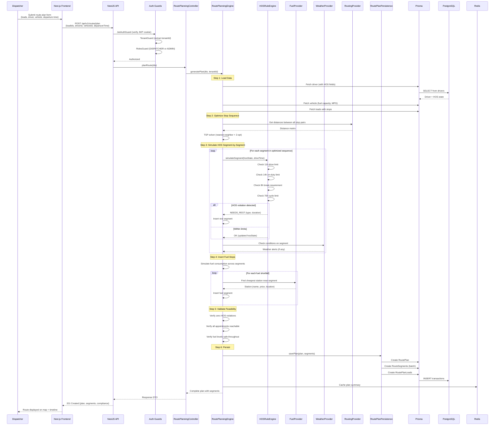
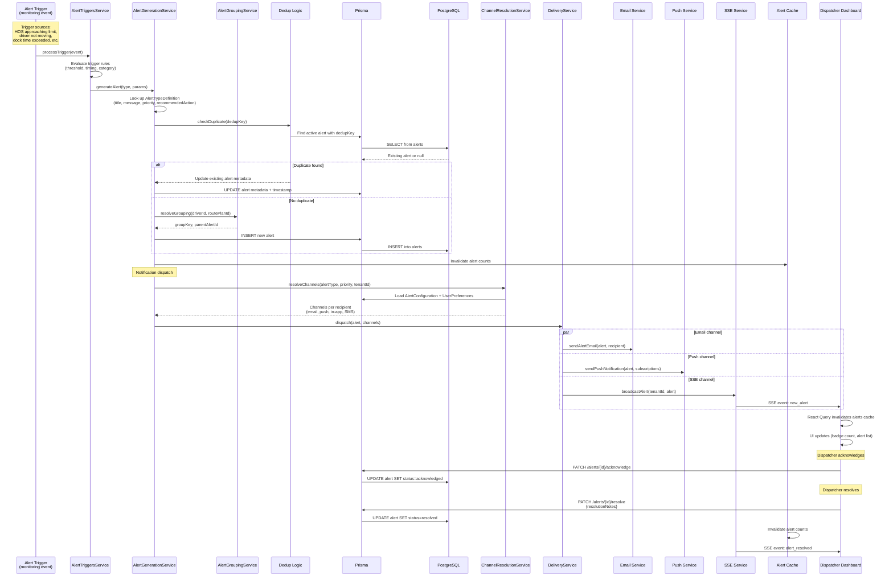
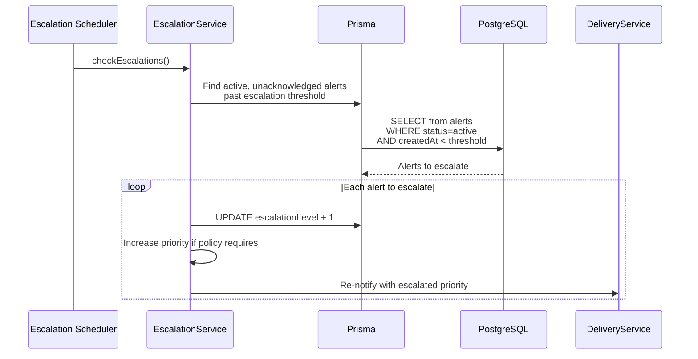
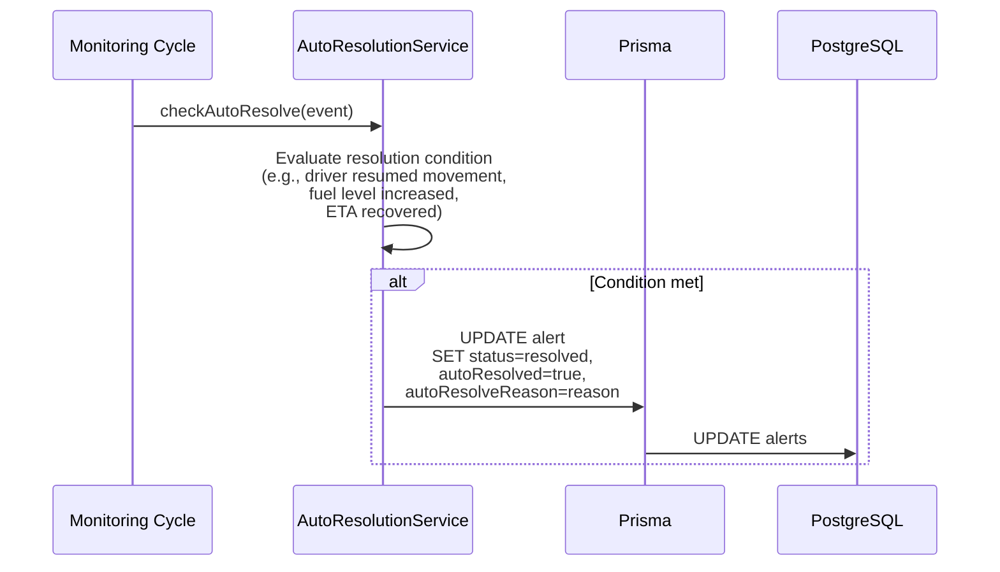
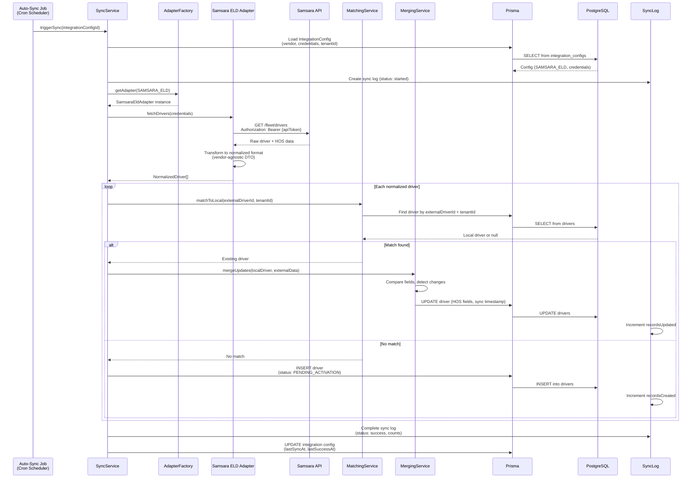
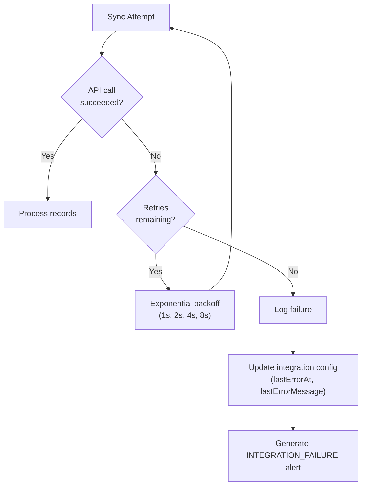
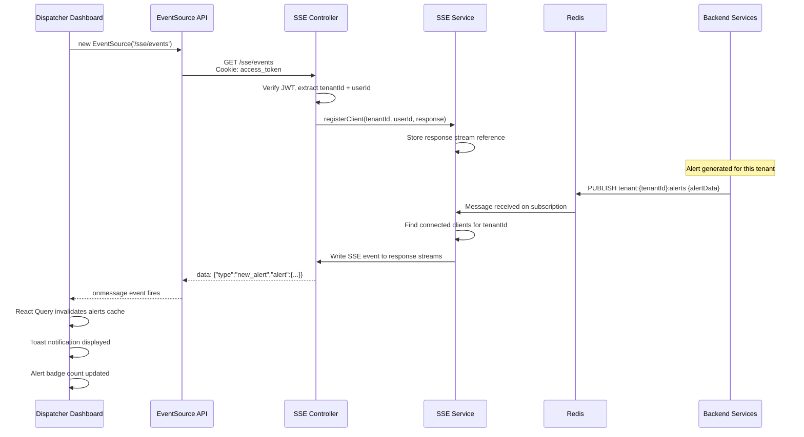
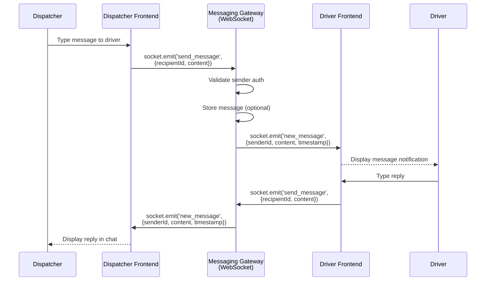
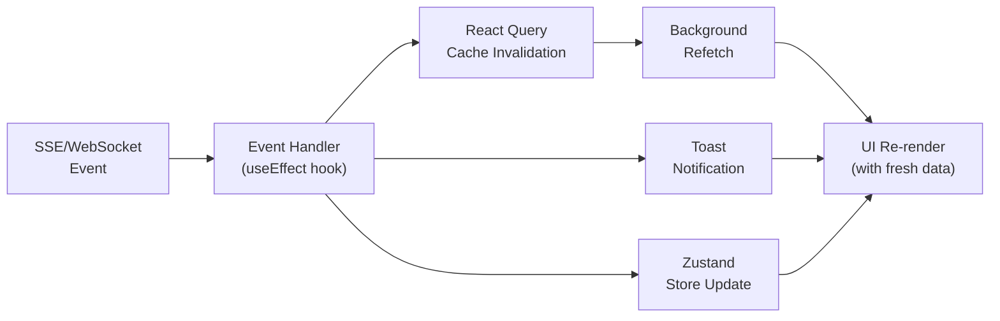

# Data Flow

This page traces how data moves through the SALLY platform for the four most important operations: route planning, alert lifecycle, integration synchronization, and real-time event delivery. Each flow includes a sequence diagram showing the exact path a request takes through the system's components.

---

## Route Planning Request

When a dispatcher creates a new route plan, the request passes through authentication, the planning engine pipeline, and persistence before returning the complete plan with all segments.

### What Gets Returned

The response includes:

- **Plan summary** -- Total distance, drive time, on-duty time, cost estimate, feasibility status, daily breakdown.
- **Ordered segments** -- Each segment with type (drive/rest/fuel/dock), locations, timing, and HOS state snapshot after completion.
- **Compliance report** -- A structured record confirming zero violations, with details of every rest stop insertion and the reasoning behind it.
- **Feasibility issues** -- If the route cannot be completed without violations (e.g., appointment windows are impossible), the issues array explains why.

---

## Alert Lifecycle

Alerts flow from trigger detection through generation, notification, and resolution. This is the most complex data flow in the system because it involves multiple services working in concert.

### Alert Channel Resolution

The channel resolution service determines how each alert reaches the right people through the right channels:

1. **Tenant defaults** (`AlertConfiguration.defaultChannels`) define the baseline: e.g., critical alerts go to email + push + in-app; low-priority alerts are in-app only.
2. **User overrides** (`UserPreferences.alertChannels`) allow individual dispatchers to customize: e.g., "send me SMS for critical alerts too."
3. **Quiet hours** (`UserPreferences.quietHoursEnabled/Start/End`) suppress non-critical notifications during off hours.
4. **Category filtering** (`UserPreferences.alertCategories`) lets users opt out of entire alert categories.

### Escalation Flow

Unacknowledged alerts escalate automatically:

### Auto-Resolution

Certain alert types auto-resolve when conditions clear:

---

## Integration Sync Flow

External integrations synchronize data on scheduled intervals. The flow demonstrates the ELD sync pattern; TMS sync follows the same structure with different entity types.

### Sync Characteristics

| Aspect | ELD Sync (Samsara, Motive) | TMS Sync (McLeod, project44) |
|---|---|---|
| Entities synced | Drivers + HOS clocks | Loads + Stops + Appointments |
| Sync frequency | Configurable (default: 5 min) | Configurable (default: 15 min) |
| Matching key | `externalDriverId` | `externalLoadId` |
| New record status | `PENDING_ACTIVATION` | `pending` |
| HOS fields updated | 6 structured fields + raw JSON | N/A |
| Conflict resolution | External data wins (ELD is source of truth) | External data wins for load status; manual edits preserved for notes |

### Error Handling

When an integration sync fails after all retries, the system:

1. Records the error in the sync log with full details.
2. Updates the integration config's error fields for the health dashboard.
3. Sets the integration status to `ERROR`.
4. Generates an `INTEGRATION_FAILURE` alert so dispatchers know their data may be stale.

---

## Real-Time Events Flow

SALLY uses two real-time protocols for different communication patterns.

### SSE: Server-to-Client Push

Server-Sent Events deliver unidirectional updates from the backend to the dispatcher dashboard. This is used for alerts, route status changes, and integration sync progress.

### WebSocket: Bidirectional Messaging

WebSocket (via Socket.IO) handles the messaging gateway between dispatchers and drivers, where both sides send and receive in real-time.

### When Each Protocol Is Used

| Protocol | Direction | Use Cases |
|---|---|---|
| SSE | Server to Client | Alert notifications, route status updates, integration sync progress, ETA changes |
| WebSocket | Bidirectional | Dispatcher-driver messaging, acknowledgment requests, real-time chat |
| HTTP polling | Client to Server | Fallback when SSE/WebSocket unavailable; React Query background refetch |

### Frontend Event Handling

When real-time events arrive at the frontend, they follow a consistent pattern:

1. **Event arrives** via SSE `onmessage` or Socket.IO `on` handler.
2. **React Query cache invalidation** marks relevant queries as stale, triggering a background refetch to get the complete data from the API.
3. **Toast notification** shows a brief visual alert for high-priority events (new critical alert, message received).
4. **Zustand store update** for UI state that does not need an API round-trip (e.g., incrementing the unread count badge).

This pattern ensures the UI always shows server-authoritative data (via React Query refetch) while providing instant visual feedback (via toast and store updates).

---

## Summary: Data Flow Patterns

| Flow | Entry Point | Key Services | Data Store | Real-Time Output |
|---|---|---|---|---|
| Route Planning | `POST /api/v1/routes/plan` | RoutePlanningEngine, HOSRuleEngine, Providers | PostgreSQL (plans, segments), Redis (cache) | None (synchronous response) |
| Alert Lifecycle | Trigger event (internal) | AlertTriggers, AlertGeneration, AlertGrouping, Escalation, ChannelResolution, Delivery | PostgreSQL (alerts), Redis (pub/sub) | SSE (new_alert, alert_resolved) |
| Integration Sync | Cron scheduler | SyncService, AdapterFactory, Matching, Merging | PostgreSQL (drivers/loads, sync logs) | SSE (sync_progress) |
| Messaging | WebSocket event | MessagingGateway | Optional persistence | WebSocket (new_message) |

---

## Further Reading

- [System Overview](/developer-guide/architecture) -- High-level architecture context for these flows
- [Backend Architecture](/developer-guide/architecture/backend) -- Detailed module structure of the services referenced here
- [Database Schema](/developer-guide/architecture/database) -- Table structures that these flows read and write
- [Frontend Architecture](/developer-guide/architecture/frontend) -- How the frontend handles the responses and events described here
